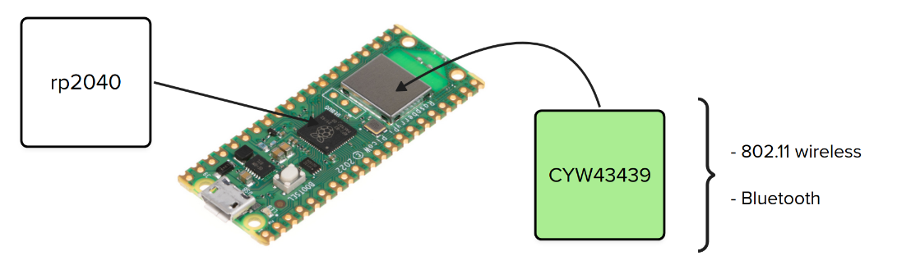
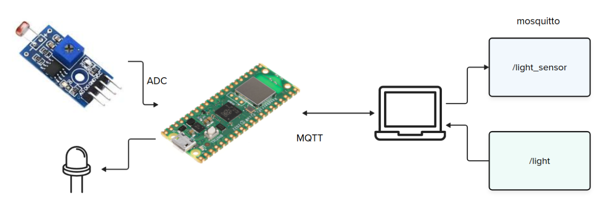

# Expert - Comunicacao - wifi            

Neste laboratório, vamos explorar os recursos de conectividade `Wi-Fi` da `Raspberry Pi Pico W` e aprender sobre MQTT.

::: tip Código exemplo
Utilize o código exemplo a seguir nessa entrega

https://github.com/insper-embarcados/pico-wifi-rtos-mqtt
:::

## Pico W

Sistemas embarcados muitas vezes precisam se comunicar com outros dispositivos ou se conectar à internet. Existem várias soluções possíveis para essa comunicação, que vão desde protocolos proprietários de rádio frequência (por exemplo, um [sensor de frequência cardíaca](https://www.polar.com/br/sensores/sensor-de-frequencia-cardiaca/h9)) até o uso de tecnologias como: Wi-Fi, Bluetooth, 4G e Ethernet. Recentemente, surgiram muitas soluções para comunicação de longas distâncias e baixo consumo energético, como LoRa ou Sigfox.

A Raspberry Pi possui diversas placas de desenvolvimento, e uma delas, a Pico W, conta além do microcontrolador RP2040 (que temos programado até agora), com um outro dispositivo chamado `CYW43439`, que funciona como uma placa de rede e implementa tanto a comunicação Wi-Fi quanto Bluetooth:



::: warning
Para fazer esta trilha você deve utilizar a placa PICO W.
:::

## MQTT

::: info
Antes de seguir, consulte o material de Wi-Fi:

- [guides/pico-wifi](/guides/pico-wifi)
:::

Ao trabalharmos com Wi-Fi e internet, podemos optar por diferentes protocolos de comunicação, entre eles o HTTP/HTTPS, muito popular em serviços web. Porém, para sistemas embarcados, esse protocolo apresenta alguns problemas, como consumo elevado de recursos (memória e processamento), latência relativamente alta e overhead significativo devido ao tamanho dos cabeçalhos e à necessidade de manter conexões estáveis – o que pode ser inviável em dispositivos com restrições severas de hardware e energia.

Pensando nisso, diversas soluções foram criadas, e uma bastante popular atualmente é o MQTT, um protocolo leve de publicação/assinatura projetado para comunicação eficiente em redes instáveis ou de baixa largura de banda, ideal para aplicações IoT e sistemas embarcados com recursos limitados.

Enquanto o HTTP usa um modelo requisição-resposta (com métodos como GET e POST), que exige que o cliente sempre inicie a comunicação e aguarde a resposta do servidor, o MQTT opera em um modelo de publicação/assinatura mediado por um broker, permitindo comunicação assíncrona e contínua. Além disso, o MQTT é muito mais eficiente em termos de overhead de dados: enquanto um HTTP POST pode adicionar dezenas ou centenas de bytes extras em cabeçalhos, uma mensagem MQTT pode ter apenas alguns bytes, tornando-o mais adequado para conexões intermitentes e dispositivos com baixo poder computacional. Outra diferença importante é que o MQTT mantém a conexão persistente, possibilitando atualizações em tempo real sem a necessidade de novas requisições – ao contrário do HTTP, que precisa abrir e fechar a conexão a cada requisição.

No MQTT, a comunicação é organizada por meio de "tópicos", que funcionam como canais hierárquicos onde as mensagens são publicadas e assinadas. Um tópico é identificado por uma string de texto separada por barras (por exemplo: sensor/temperatura/sala1). Os dispositivos que publicam enviam mensagens para um tópico específico, enquanto os dispositivos assinantes recebem automaticamente qualquer mensagem publicada nesse tópico. Esse sistema permite que múltiplos dispositivos se comuniquem de forma desacoplada: o publicador não precisa saber quem vai receber a mensagem, e o assinante não precisa saber quem está enviando. Além disso, o MQTT suporta curingas como + (para um nível da hierarquia) e # (para múltiplos níveis), permitindo grande flexibilidade na assinatura de tópicos.

## Exemplo

::: warning
O Wi-Fi do Insper utiliza uma autenticação complexa por certificado, o que impede nossa plaquinha de utilizar
a rede. Temos uma rede disponível no laboratório para vocês utilizarem.

Se não estiver no laboratório, utilize seu celular como roteador.

**Lembre-se de conectar o computador e o embarcado na mesma rede.**
:::

O exemplo fornecido foi "copiado" da lista de exemplos oficiais da Raspberry Pi Pico W, com pequenas modificações para poder ser compilado fora do ambiente de exemplos. O código é grande e mais complicado do que vocês estão acostumados, pois envolve diversas bibliotecas (socket, Wi-Fi, lwIP...).

O exemplo possui duas etapas:

* Um broker: servidor que irá hospedar os dados do MQTT.
* Firmware: código embarcado que se conecta ao broker.

### Broker

Podemos entender o MQTT como o Git e o broker como o GitHub. Existem diversos brokers online que oferecem muitos recursos – um interessante é o [https://thingsboard.io/](https://thingsboard.io/). Mas, neste exemplo, iremos usar um broker mais simples e que funciona localmente: o [Mosquitto](https://mosquitto.org/), gerenciado pela Eclipse Foundation.

No README do repositório há os passos para fazer o Mosquitto funcionar.

### Firmware

Neste exemplo, a Pico fica constantemente lendo a temperatura interna e enviando as informações para um tópico "/temperature", isso acontece na função `publish_temperature`:

```
static void publish_temperature(MQTT_CLIENT_DATA_T *state) {
    static float old_temperature;
    const char *temperature_key = full_topic(state, "/temperature");
    float temperature = read_onboard_temperature(TEMPERATURE_UNITS);
    if (temperature != old_temperature) {
        old_temperature = temperature;
        // Publish temperature on /temperature topic
        char temp_str[16];
        snprintf(temp_str, sizeof(temp_str), "%.2f", temperature);
        INFO_printf("Publishing %s to %s\n", temp_str, temperature_key);
        mqtt_publish(state->mqtt_client_inst, temperature_key, temp_str, strlen(temp_str), MQTT_PUBLISH_QOS, MQTT_PUBLISH_RETAIN, pub_request_cb, state);
    }
}
```

Código que lida com comunicação geralmente utiliza callbacks para executar ações. No caso deste exemplo, o código configura para que a função `publish_temperature` seja chamada a cada `#define TEMP_WORKER_TIME_S 10` (10 segundos).

O MQTT também permite que a placa se inscreva em um tópico e, sempre que houver alguma mudança no valor do tópico no broker, o sistema embarcado é notificado. No caso do exemplo, nosso microcontrolador se inscreve nos tópicos: `/led`, `/print`, `/ping` e `/exit`, na função a seguir:

```
static void sub_unsub_topics(MQTT_CLIENT_DATA_T* state, bool sub) {
    mqtt_request_cb_t cb = sub ? sub_request_cb : unsub_request_cb;
    mqtt_sub_unsub(state->mqtt_client_inst, full_topic(state, "/led"), MQTT_SUBSCRIBE_QOS, cb, state, sub);
    mqtt_sub_unsub(state->mqtt_client_inst, full_topic(state, "/print"), MQTT_SUBSCRIBE_QOS, cb, state, sub);
    mqtt_sub_unsub(state->mqtt_client_inst, full_topic(state, "/ping"), MQTT_SUBSCRIBE_QOS, cb, state, sub);
    mqtt_sub_unsub(state->mqtt_client_inst, full_topic(state, "/exit"), MQTT_SUBSCRIBE_QOS, cb, state, sub);
}
```

E o dado é processado em:

```c
static void mqtt_incoming_data_cb(void *arg, const u8_t *data, u16_t len, u8_t flags) {
    MQTT_CLIENT_DATA_T* state = (MQTT_CLIENT_DATA_T*)arg;
#if MQTT_UNIQUE_TOPIC
    const char *basic_topic = state->topic + strlen(state->mqtt_client_info.client_id) + 1;
#else
    const char *basic_topic = state->topic;
#endif
    strncpy(state->data, (const char *)data, len);
    state->len = len;
    state->data[len] = '\0';

    DEBUG_printf("Topic: %s, Message: %s\n", state->topic, state->data);
    if (strcmp(basic_topic, "/led") == 0)
    {
        if (lwip_stricmp((const char *)state->data, "On") == 0 || strcmp((const char *)state->data, "1") == 0)
            control_led(state, true);
        else if (lwip_stricmp((const char *)state->data, "Off") == 0 || strcmp((const char *)state->data, "0") == 0)
            control_led(state, false);
    } else if (strcmp(basic_topic, "/print") == 0) {
        INFO_printf("%.*s\n", len, data);
    } else if (strcmp(basic_topic, "/ping") == 0) {
        char buf[11];
        snprintf(buf, sizeof(buf), "%u", to_ms_since_boot(get_absolute_time()) / 1000);
        mqtt_publish(state->mqtt_client_inst, full_topic(state, "/uptime"), buf, strlen(buf), MQTT_PUBLISH_QOS, MQTT_PUBLISH_RETAIN, pub_request_cb, state);
    } else if (strcmp(basic_topic, "/exit") == 0) {
        state->stop_client = true; // stop the client when ALL subscriptions are stopped
        sub_unsub_topics(state, false); // unsubscribe
    }
}
```

## Entrega



Um sistema embarcado que possua Wi-Fi e utilize o protocolo MQTT para enviar a um broker (Mosquitto) leituras periódicas de luminosidade do ambiente e permita acender um LED localmente.
