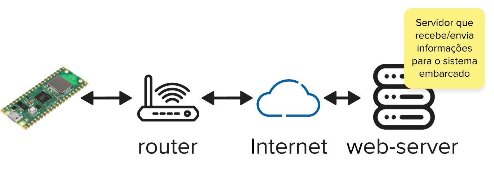

# Expert - wifi

Neste laboratório vamos explorar os recursos de conectividade `Wi-Fi` da `Raspberry Pi Pico W`. 

!!! info
    Antes de seguir, consulte o material de wifi em:100%
    
    - [Pico W/WIFI](/site/pico/pico-wifi)

## Lab

Sistemas embarcados devem muitas vezes se comunicarem com outros dispositivos, ou se conectarem a internet. Muitas são as soluções que podemos assumir para a comunicação, que vão desde de protocolos proprietários de comunicacão de rádio frequência (por exemplo uma [sensor de frequência cardíaca](https://www.polar.com/br/sensores/sensor-de-frequencia-cardiaca/h9)) ou o uso de comunicacoes como: WIFI, bluetooth, 4G, Ethernet. Recentemente muitas soluções surgiram para a comunicação de longas distâncias e com baixo consumo energético como: LoRA ou Sigfox.

O nosso kit de desenvolvimento possui além do microcontrolador rp2040 (o que temos programado até agora), um outro dispositivo chamado de `CYW43439` que funciona como uma placa de rede e implementa tanto a comunicação wifi quanto bluetooth:

O WIFI é uma solução importante e utilizada em muitos produtos, mas possui uma série de problemas que devem ser levadas em consideração:

- Alto consumo energético
- Necessita conectar a um "roteador"
- Problemas com diferentes tipos de rede e autenticação

Mas tem muitas vantagens, como:

- Maneira mais fácil de se conectar na internet
- Alta taxa de transmissão
- Compatibilidade com muitos dispositivos
- Múltiplos dispositivos na mesma rede

!!! tip
    Como fazer um sistema embarcado que não possui "teclado" nem "tela" se conectar em uma rede wifi? O usuário precisa encontrar a rede dele e configurar a senha, para que o sistema se conecte... como fazer isso?

### Serviços

O sistema embarcado pode se comportar de duas maneiras, como um web server ou como um cliente, normalmente a segunda opção é a mais utilizada por limitações e seguranças da rede (o seu roteador bloqueia que qualquer dispositivo externo a sua rede se conecte em um dispositivo interno).  

Muitas são as soluções que podemos empregar para criar esse web server (pode criar o seu próprio serviço, lembre de tec web!), mas como queremos facilitar a nossa vida, podemos usar recursos como:

- [Node-red](https://nodered.org/)
- [IFTTT](https://ifttt.com/explore)
- [Zapier](https://zapier.com/)

## Entrega

Um sistema embarcado que se conecta a um servidor local (flask) e envia periodicamente dados de uma leitura analógica. O servidor deve imprimir (ou exibir em html) os valores lidos.

<!--
A entrega deve ser um sistema embarcado com WIFI na qual você é capaz de ler dados de um potenciometro e enviar as informacoes para uma planilha do google sheets, simulando um dataloger.

Para isso você deverá:

- Entender com o wifi funciona, consulte a página no site da matéria [Pico W/wifi](/site/pico/pico-wifi).
- Para fazer o post no IFTTT/Zapier deve usar o exemplo da pico: https://github.com/raspberrypi/pico-examples/blob/master/pico_w/wifi/tcp_client/
- Usar o IFTTT e o Zapier com o servico (`web request`) que você consegue fazer um post e ele atualiza automaticamente a tabela do excel.
-->
