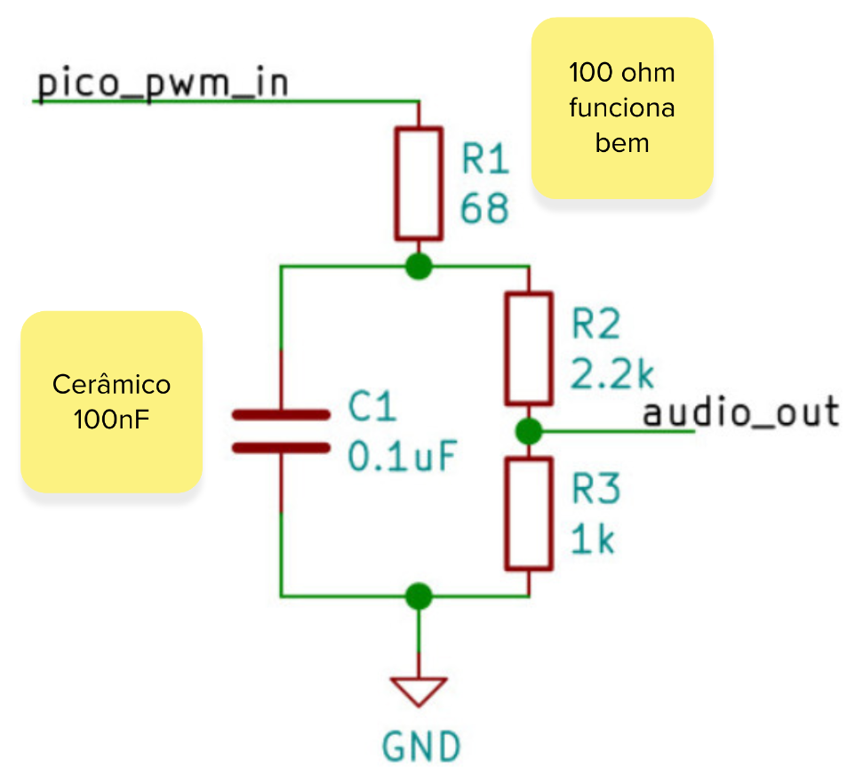

# Expert - DSP - Áudio - OUT

Neste laboratório iremos criar um sistema capaz de reproduzir uma série de sons pré criados.

::: info Código base
Você deve utilizar o repositório a seguir para realizar o lab.

- https://github.com/rgrosset/pico-pwm-audio

Leia as instrucões no README para sabe como converter um áudio.
:::

## Áudio

O desafio é como fazemos para gerar o áudio, a maioria dos microcontroladores possui o conversor analógico para digital, mas poucos possuem um digital para analógico (DAC), que iria facilitar muito a nossa vida, já que poderíamos simplesmente "copiar o som para o pino" e teríamos um som analógico sendo produzido, ai bastaria amplificar o sinal e pronto, teríamos um áudio sendo reproduzido!

Como não temos o DAC, poderíamos pensar em algumas alternativas:

- Usar um `codec de áudio` externo para fazer a conversão
- Conectar um conversor digital para analogico (DAC) 

Mas existe uma alternativa mais fácil e que não demanda o uso de um novo dispositivo, a alternativa envolve criarmos um DAC a partir de um PWM e um `filtro passa-baixa` passivo composto de um resistor e capacitor:

O repositório a seguir possui uma bom exemplo e demonstração de como gerar um áudio usando essa técnica na nossa pico! Inclusive com exemplo de como reproduzir uma música!

- https://github.com/rgrosset/pico-pwm-audio/tree/main

No lugar de usar o filtro indicado no repositório, vocês devem usar esse como alternativa: 

{width=300}

::: tip
Outras referências: 

- http://antirez.com/news/143
- http://www.openmusiclabs.com/learning/digital/pwm-dac.1.html
- https://gregchadwick.co.uk/blog/playing-with-the-pico-pt3/
:::

## Eletrônica

O microcontrolador não possui potência para acionar um falante, para isso teremos que usar um amplificador, como indicado a seguir:

::: info
Notem que estamos utilizando um amplificador (azul) para podermos ligar o falante.
:::

Segue a versão corrigida e aprimorada do texto, mantendo o sentido original e melhorando a clareza e a norma culta:

## Entrega

Você deve desenvolver um sistema embarcado que possua **três botões**. Dois deles serão responsáveis por escolher qual som será reproduzido:

* O som de um animal
* Uma frase com a sua voz

O terceiro botão será de **play/pause**. Quando pressionado durante a execução do som, ele deve **interromper a reprodução**. Ao ser pressionado novamente, o som deve **continuar a partir do ponto em que foi interrompido**.
