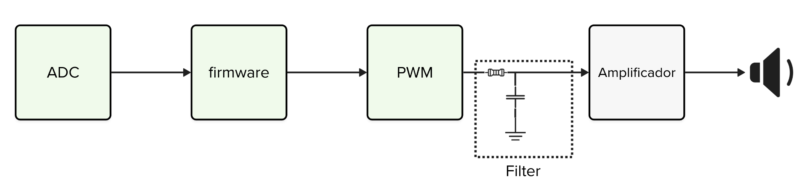

# Expert - DSP - Áudio

Neste laboratório iremos criar um sistema capaz de captar um sinal de áudio com um microfone e reproduzir o sinal lido em um speaker! 

::: info Pico Examples
Para conseguir rodar códigos do pico examples, consulte a página a página:

- https://github.com/insper-embarcados/pico-audio
:::

## Áudio

Fazer a leitura de um microfone é fácil, basta configurar o 'ADC' para ler o valor que o microfone gera, criar uma base de tempo para controlar a frequência de amostragem dos dados, e fazer a captura periódicamente. Para saber como usar um microfone na pico, consulte:

- [pico-examples/adc/microphone_adc]( https://github.com/raspberrypi/pico-examples/tree/master/adc/microphone_adc)

Agora o desafio é como fazemos para gerar o áudio, a maioria dos microcontroladores possui o conversor analógico para digital, mas poucos possuem um digital para analógico (DAC), que iria facilitar muito a nossa vida, já que poderíamos simplesmente copiar o valor do ADC para DAC e buuumm!!, teríamos um som sendo gerado no pino, ai bastaria amplificar o sinal e pronto, teríamos um áudio sendo reproduzido!

Como não temos o DAC, poderíamos pensar em algumas alternativas:

- Usar um `codec de áudio` externo para fazer a conversão
- Conectar um conversor digital para analogico (DAC) 

Mas existe uma alternativa mais fácil e que não demanda o uso de um novo dispositivo, a alternativa envolve criarmos um DAC a partir de um PWM e um `filtro passa-baixa` passivo composto de um resistor e capacitor:

O repositório a seguir possui uma bom exemplo e demonstração de como gerar um áudio usando essa técnica na nossa pico! Inclusive com exemplo de como reproduzir uma música!

- https://github.com/rgrosset/pico-pwm-audio/tree/main

No lugar de usar o filtro indicado no repositório, vocês devem usar esse como alternativa: 

{width=300}

::: tip
Outras referências: 

- http://antirez.com/news/143
- http://www.openmusiclabs.com/learning/digital/pwm-dac.1.html
- https://gregchadwick.co.uk/blog/playing-with-the-pico-pt3/
:::

## Exemplo

O código exemplo coleta 2s de áudio e na sequência o reproduz, e possui a seguinte estrutura:

Você deve realizar a montagem do microfone, conectando no PIN 27:

{width=400}

E depois da saída de áudio conectando no PIN 26:

::: info
Notem que estamos utilizando um amplificador (azul) para podermos ligar o falante.
:::

## Entrega

Você deve entregar um sistema capaz de detectar quando uma pessoa começa a falar e, então, armazenar um áudio de 4 segundos de duração, aplicar um filtro passa-baixas no áudio e reproduzi-lo via PWM.

- Faça a conexão do hardware.
- Execute o exemplo fornecido.
- Aplique um filtro no valor lido pelo ADC.
- Modifique o código para detectar quando alguém começou a falar.
- Reproduza o áudio.
