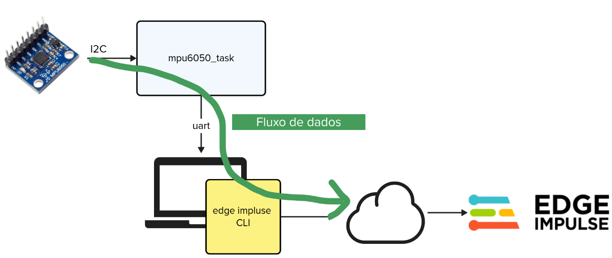
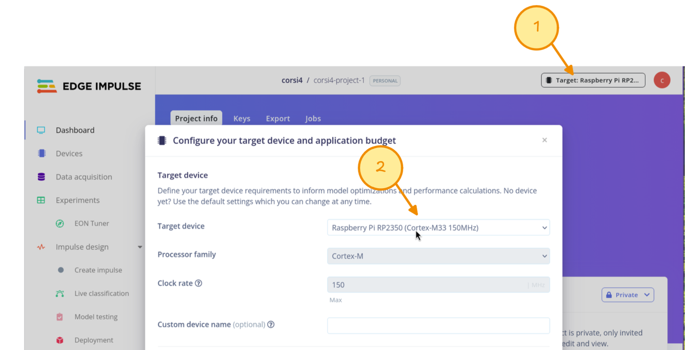
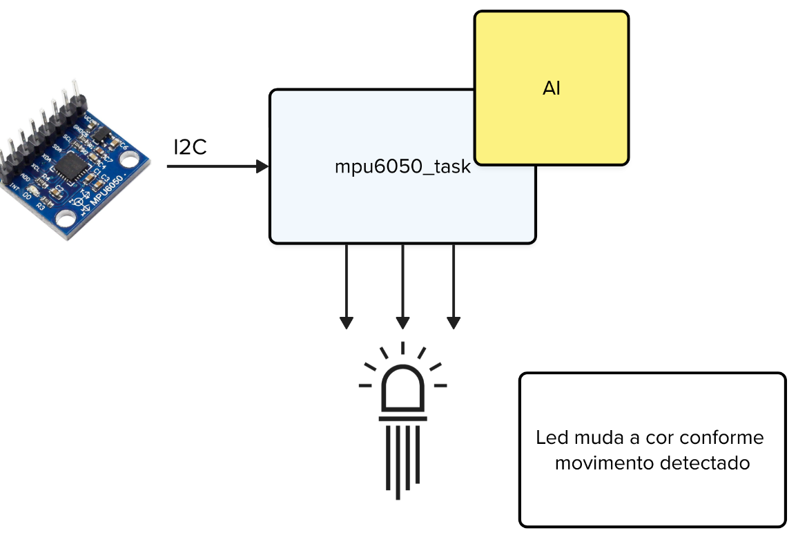
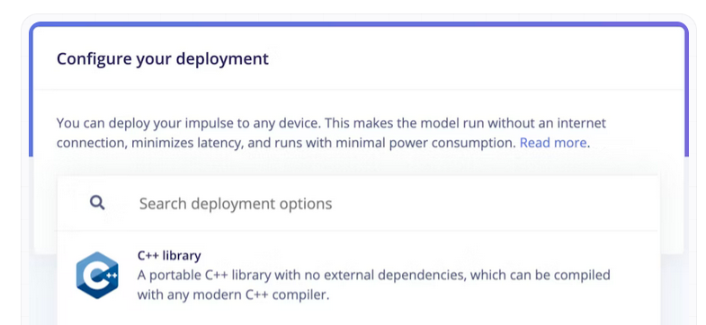
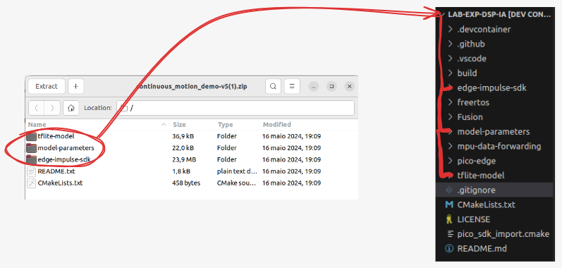

# Expert - DSP - Inteligência Artificial

Neste laboratório você utilizará a **Raspberry Pi Pico 2** junto com o sensor **MPU6050 IMU** para classificar movimentos de um acelerômetro no espaço utilizando a plataforma **Edge Impulse** utilizando como referência o demo oficial. O que importa neste laboratório é a expertise em utilizar a plataforma do Edge Impulse para treinar movimento, e para isso iremos treinar um modelo capaz de identificar os seguintes padrões de movimento:

- idle (parado)
- updown (cima-baixo)
- wave (acenando)

Ao final, seu dispositivo embarcado será capaz de fazer inferência local desses movimentos, sem necessidade de conexão com a internet e o modelo rodando na própria Pico 2.

<YouTube id="Yk3hq3IcJR4"/>

Esse laboratório trabalha com o paradigma de **Edge computing** onde os dados são processados o mais próximo possível da sua origem ("na borda"). Isso resulta em:

- Latência reduzida
- Menor tráfego de dados para a nuvem
- Maior confiabilidade e velocidade em aplicações críticas

> "Uma fábrica moderna com 2.000 equipamentos pode gerar 2.200 terabytes de dados por mês. Processar esses dados localmente é mais rápido e econômico."  
> Fonte: [RedHat - O que é Edge Computing?](https://www.redhat.com/pt-br/topics/edge-computing/what-is-edge-computing)

Existem diversas plataformas que podemos utilizar para treinar e gerar os códigos necessários para executarmos nossa rede. Nesse laboratório iremos trabalhar com o [Edge impulse](https://www.edgeimpulse.com/).

### Visão geral

Neste laboratório, você conectará o sensor `MPU6050` (IMU) à Raspberry Pi Pico 2 utilizando a interface I2C para capturar dados de movimento (aceleração e giroscópio). Esses dados serão enviados em tempo real ao Edge Impulse utilizando a ferramenta `edge-impulse-data-forwarder`. Com isso, será possível criar um conjunto de dados rotulado para treinar um modelo de classificação de movimentos diretamente na nuvem.

O modelo resultante será exportado como biblioteca C++ e incluído no firmware que será executado localmente no microcontrolador, permitindo inferência offline dos movimentos: idle, updown e wave com indicação visual através de um LED RGB.

Vocês devem consultar a documentação oficial para entenderem como utilizar o `edge impulse`:

- [Continuous Motion Recognition](https://docs.edgeimpulse.com/docs/tutorials/end-to-end-tutorials/continuous-motion-recognition)

O laboratório deverá ser realizado em duas etapas:

- **Parte 1**: Coleta de dados e treinamento da rede neual
- **Parte 2**: Deploy e execução da rede neural

## Parte 1

Aqui iremos coletar dados de aceleração, fazer o envio para o `edge-impluse` e treinar uma rede neural capaz de detectar os movimentos. Isso será feito utilizando um firmware que envia pela serial dados padronizados, um software fornecido pelo `edge-impulse` chamado de `data-forwarding` será executado a fim de transmitir os dados do PC para a plataforma online que serão classificados, com os dados classificados uma rede neural será treinada.



1. Primeiro comece instalando o **Edge impluse CLI** seguindo o [tutorial oficial ](https://docs.edgeimpulse.com/tools/clis/edge-impulse-cli/installation)
2. Agora monte a IMU na pico e [execute o firmware](https://github.com/insper-embarcados/edgeimpulse-dataforwarding) que irá coletar dados de aceleracao e envia para o `edge impulse cli`.
3. Execute o `edge impluse cli` no seu computador executando: 

```bash
edge-impulse-data-forwarder
```
4. Acesse o edge impluse (você terá que logar) e siga o [tutorial oficial](https://docs.edgeimpulse.com/tutorials/end-to-end/motion-recognition) até a **etapa 6: Deploying back to device**.

Note que você deve escolher que estamos trabalhando com a RP 2350 (pico 2):



## Parte 2



Agora iremos exportar uma rede neural que poderá ser executada no microcontrolador, para isso o `edge impulse` fornece toda uma estrutura de código em C++ que permite executarmos a rede embarcada, eles fornecem porjetos exemplos para diferentes tipos de processadores e kits de desenvolvimento. Devemos então usar o código exemplo, atualizar o peso da nossa rede e fazer o processamento que acharmos relevante.

> Para facilitar a vida de vocês criamos um projeto exemplo para a pico2, baseado no que eles já fornecem (a única diferenća aqui é que o nosso `main` está em C e não em C++). Utilize esse repositório!

1. Clone o [repositório exemplo](https://github.com/insper-embarcados/edgeimpluse-runner) que executa a rede neural


::: details 2. Na plataforma do `edge impluse` exporte a rede no formato `C++ Library`

:::

3. Agora atualize os arquivos do repositório exemplo com o que foi gerado pelo edge impluse:

> Substitua apenas: **tflite-model**, **model-parameters**, **edge-impulse-sdk**



> É necessário substituir esses arquivos do teu projeto que vieram por padrão pelo gerado na etapa de **Deploy** no site do **Edge Impulse**, esses arquivos juntos compõem o Output do seu modelo treinado, sendo eles essenciais para que sua aplicação funcione.

4. Execute o firmware, analise a saída da UART. Movimente a placa para classificarmos os movimentos.

### Entrega final

A entrega final você deve acender um LED para cada um dos movimentos detectados, indicamos fazer isso com um LED RGB.

- Modelo treinado com 3 classes: idle, wave, updown
- Projeto embarcado funcional com classificação local
- LED RGB indicando o estado classificado

## Referências:

https://edgeimpulse.com/about

https://www.redhat.com/pt-br/topics/edge-computing/what-is-edge-computing
