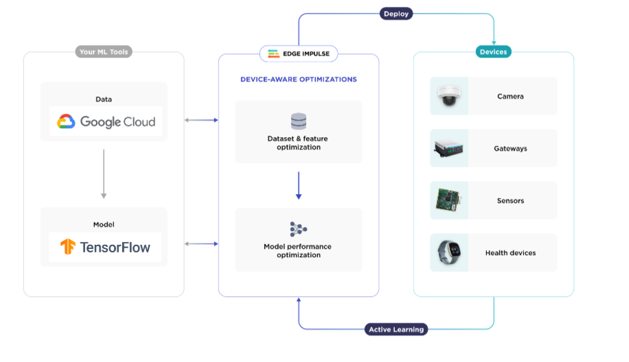
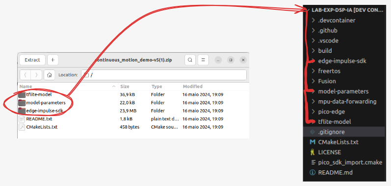

# Expert - DSP - Inteligência Artificial

Neste laboratório você utilizará a **Raspberry Pi Pico W** junto com o sensor **MPU6050 IMU** para classificar movimentos de um acelerômetro no espaço utilizando a plataforma **Edge Impulse**. Iremos treinar um modelo capaz de identificar os seguintes padrões de movimento:

- idle (parado)
- updown (cima-baixo)
- wave (acenando)

Ao final, seu dispositivo embarcado será capaz de fazer inferência local desses movimentos, sem necessidade de conexão com a internet.

!!! tip
    Vocês devem utilizar os repositórios a seguir, utilize o  `lab-exp-dsp-ia-mpu-forwarder` para fazer a captura dos dados da imu para o edge-impulse, e quando finalizar o laboratório e tiver gerado o modelo utilize o `lab-exp-dsp-ia` para deploy do seu modelo e teste, mais informações sobre como fazer isso a seguir.
    
    - https://github.com/insper-embarcados/lab-exp-dsp-ia-mpu-forwarder

    - https://github.com/insper-embarcados/lab-exp-dsp-ia

## Conceitos Importantes

### Edge Computing

**Edge Computing** é uma arquitetura de TI onde os dados são processados o mais próximo possível da sua origem ("na borda"). Isso resulta em:

- Latência reduzida
- Menor tráfego de dados para a nuvem
- Maior confiabilidade e velocidade em aplicações críticas

> "Uma fábrica moderna com 2.000 equipamentos pode gerar 2.200 terabytes de dados por mês. Processar esses dados localmente é mais rápido e econômico."  
> Fonte: [RedHat - O que é Edge Computing?](https://www.redhat.com/pt-br/topics/edge-computing/what-is-edge-computing)

### Edge Impulse

O **Edge Impulse** é uma plataforma que ajuda desenvolvedores a criar modelos de machine learning para dispositivos embarcados de forma acessível e escalável.

### Edge Impulse CLI

Ferramenta de linha de comando usada para configurar e conectar dispositivos ao Edge Impulse. Veja a [documentação oficial](https://docs.edgeimpulse.com/docs/tools/edge-impulse-cli).

## Instalação 

> IMPORTANTE: Para instalar corretamente siga os passos descritos na documentação oficial. 
> [https://docs.edgeimpulse.com/docs/tools/edge-impulse-cli/cli-installation](https://docs.edgeimpulse.com/docs/tools/edge-impulse-cli/cli-installation)

Basicamente as etapas são:

1. Criar uma conta no [Edge Impulse](https://edgeimpulse.com/).

2. **Python 3** instalado no computador.

3. Instale **Node.js** v20 ou superior no computador.

#### Instalação linux/MAC

etapas para instalaçao em Linux/MAC:

bash
curl -sL https://deb.nodesource.com/setup_20.x | sudo -E bash -
sudo apt-get install -y nodejs
node -v

Verifique o diretório de instalação do Node.

bash
npm config get prefix

> Se retornar **/usr/local/**, rode os seguintes comandos para mudar o diretório padrão do npm.
>
> 
bash
> mkdir ~/.npm-global
> npm config set prefix '~/.npm-global'
> echo 'export PATH=~/.npm-global/bin:$PATH' >> ~/.profile
>

> No MAC com zsh,
> 
bash
> mkdir ~/.npm-global
> npm config set prefix '~/.npm-global'
> echo 'export PATH=~/.npm-global/bin:$PATH' >> ~/.zprofile
>

4. Instale o edge-impulse-cli.

bash
npm install -g edge-impulse-cli
reboot
 
---

#### Instalação Windows

etapas para instalação WINDOWS

1. Crie uma conta no edge-impulse

2. Instale python3 no computador

3. Instale Node.js (Instale o "tools for native modules" caso sugerido)

4. Reinicie o computador e rode o seguinte comando através do PowerShell:

> npm install -g edge-impulse-cli --force

## Prática do Laboratório

Neste laboratório, você conectará o sensor MPU6050 à Raspberry Pi Pico W utilizando a interface I2C para capturar dados de movimento (aceleração e giroscópio). Esses dados serão enviados em tempo real ao Edge Impulse utilizando a ferramenta edge-impulse-data-forwarder. Com isso, será possível criar um conjunto de dados rotulado para treinar um modelo de classificação de movimentos diretamente na nuvem.

O modelo resultante será exportado como biblioteca C++ e incluído no firmware que será executado localmente na Pico W, permitindo inferência offline dos movimentos idle, updown e wave com indicação visual através de um LED RGB.

Projeto base recomendado:
- [Continuous Motion Recognition](https://docs.edgeimpulse.com/docs/tutorials/end-to-end-tutorials/continuous-motion-recognition)

Fluxo de trabalho:

Demonstração:

!!! video
    

### Detalhes Técnicos

- Clone os repositórios: [https://github.com/insper-embarcados/lab-exp-dsp-ia-mpu-forwarder](https://github.com/insper-embarcados/lab-exp-dsp-ia-mpu-forwarder) e o [https://github.com/insper-embarcados/lab-exp-dsp-ia](https://github.com/insper-embarcados/lab-exp-dsp-ia)

- Carregue na placa o código base mpu-forwarder na Raspberry Pico. disponível no repositório com mesmo nome, deve ser utilizado para ler os dados da Pico W e encaminhá-los via serial.
- Vamos usar o edge-impulse-cli para enviar os dados da Pico W para o Edge Impulse, em um terminal, use o comando edge-impulse-data-forwarder.
- Leia a [documentação do data forwarder](https://docs.edgeimpulse.com/docs/tools/edge-impulse-cli/cli-data-forwarder)
- Durante a coleta de dados, garanta que está em execução o código mpu-data-forwarder do repositório base
- No deploy, configure para exportar como biblioteca C++.

## Entrega

### O que deve ser entregue

- Modelo treinado com 3 classes: idle, wave, updown
- Projeto embarcado funcional com classificação local
- LED RGB indicando o estado classificado (pinos GP15, GP16, GP17)
- Frequência de amostragem: 62.5 Hz
- Os arquivos gerados no Edge Impulse que deverão ser incluídos no teu repositório clonado `lab-exp-dsp-ia` são **tflite-model, model-parameters e o edge-impulse-sdk**, não inclua o restante para não desconfigurar o projeto.
- Verifique no código onde está conectado os pinos SDA e SCL do módulo I2C.

#### Substituir bibliotecas no projeto lab-exp-dsp-ia:

- Inclua apenas: tflite-model, model-parameters, edge-impulse-sdk
- Substitua os arquivos do projeto base pelos do deploy no Edge Impulse

> É necessário substituir esses arquivos do teu projeto que vieram por padrão pelo gerado na etapa de **Deploy** no site do **Edge Impulse**, esses arquivos juntos compõem o Output do seu modelo treinado, sendo eles essenciais para que sua aplicação funcione.

## Referências:

https://edgeimpulse.com/about

https://www.redhat.com/pt-br/topics/edge-computing/what-is-edge-computing
