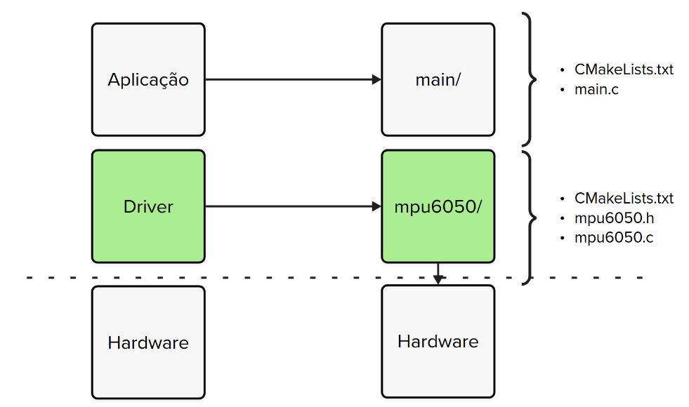

# Expert - Firmware - Driver

Neste laboratório de especialização de firmware vocês vão aprender como criar drivers para periféricos a fim de tornar o código mais portátil, eficiente e com menos falhas.

## Lab

Drivers podem ser entendidos como uma camada de software que desacopla o acesso de uma aplicação a um recurso ou hardware específico.



O termo `driver` pode aparecer com diferentes nomes: `library`, `api`, `framework`, mas quando o foco é sistemas embarcados e a abstração se refere a um componente de hardware as opções mais apropriadas são: `hardware abstraction layer (HAL)` ou `driver`.

Os drivers podem ser disponibilizados de diversas maneiras diferentes, mas no final, será composto por uma série de arquivos `.h` e `.c` que vão possibilitar a interface entre a aplicação e o hardware em questão.

### CMake

O universo de desenvolvimento da Raspberry Pi Pico é baseado em `CMake`, uma ferramenta cross plataforma para automação do processo de `build` para programas em `C` e `C++`. Leia esse material para entender como podemos criar uma lib em `C` no sistema de `CMake` da Pico:

- Lib em `C` na Pico via `CMake`:  [Link](https://community.element14.com/products/raspberry-pi/b/blog/posts/raspberry-pico-and-cmake---create-your-own-c-lib-with-header-files)

### Drivers

Drivers são camadas de software que desacoplam o baixo nível da aplicação possibilitando o reaproveitamento de código entre projetos.

### MPU6050

A MPU6050 possui muitos recursos que não foram explorados no laboratório, iremos nessa entrega expandir as opções que podemos usar com esse módulo, por exemplo, o MPU6050 pode detectar queda ou identificar quando alguém dá um `tap` no sensor. Além disso, podemos configurar a resolução que o acelerômetro vai trabalhar: `±2G`, `±4G` (depende da aplicação, 2G pode saturar o sinal).

Lembrem de consultarem os manuais da MPU6050 para mais informações:

- [Datasheet - Sparkfun](https://cdn.sparkfun.com/datasheets/Sensors/Accelerometers/RM-MPU-6000A.pdf)
- [Datasheet - InvenSense](https://invensense.tdk.com/wp-content/uploads/2015/02/MPU-6000-Datasheet1.pdf)

### Poupando energia

A MPU6050 pode gerar uma interrupção quando um movimento determinado for detectado, isso é muito útil para permitir que o sistema embarcado entre em modo sleep enquanto aguarda um movimento, e aí ele é acordado com essa interrupção processando os dados, e poupando energia quando não precisa processar (imagine um controle bluetooth que liga quando é pegado da mesa, ou um smartwatch que liga a tela quando o braço é mexido).

Para podermos usar isso, teremos que fornecer uma camada de software que permite a aplicação ativar esse recurso na MPU.

## Entrega

Nessa entrega vocês devem criar um driver chamado MPU6050, para isso é necessário criar uma nova pasta com os seguintes arquivos:

- `CMakeLists.txt`: Gerenciamento de Dependências (Inclusão de Diretórios / Adição de Executáveis e Bibliotecas / Gerenciamento de Dependências / ...):
- `mpu6050.h`: Configurações e protótipos
- `mpu6050.c`: Implementação das funções

Esses arquivos devem ser uma lib do projeto do CMake, os passos estão no material para criação da [Lib em `C` na Pico via `CMake`](https://community.element14.com/products/raspberry-pi/b/blog/posts/raspberry-pico-and-cmake---create-your-own-c-lib-with-header-files)

::: warning
O MPU6050 tem como dependência a utilização da lib hardware_i2c e ela tem como dependência a lib pico_stdlib, ou seja, você precisará inclui-las na sua lib:

`CMakeLists.txt`
```c
+ target_link_libraries(nome_da_LIB hardware_i2c pico_stdlib)
```	

`mpu6050.h`
```c
+ #include "hardware/i2c.h"
+ #include "pico/stdlib.h"
```	
:::

O driver deve suportar o que já possuímos hoje, mas não foi estruturado em forma de driver:

1. Ter um "objeto" de configuração;
2. Permitir configurar pinos e I2C a ser utilizado;
3. Funções que permitam manipular e ler a IMU;
4. Funções para configurar o motion detection.

Para realizar a entrega, você deverá ler:

- Lib em `C` na Pico via `CMake`: [Link](https://community.element14.com/products/raspberry-pi/b/blog/posts/raspberry-pico-and-cmake---create-your-own-c-lib-with-header-files)
- Driver MPU6050 Adafruit: [Link](https://github.com/adafruit/Adafruit_MPU6050/blob/88b3f5983771ed6efc6c048b2c49c77ed1d417f2/Adafruit_MPU6050.cpp#L416)

### Geral

Você deve criar as seguintes funções e demonstrar o seu uso em um projeto, notem que as funções retornam um `int`, esse valor deve ser `1` para quando a execução da funções for bem sucedida ou `0` para quando falhar (`timeout por exemplo`). 

Para deixarmos o driver mais genérico possível, vamos definir uma struct que possui as configurações necessárias para a IMU.

```c
// no arquivo .h
typedef struct imu6050 {
    // configuração do I2C
    i2c_inst_t *i2c;
    int pin_sda;
    int pin_scl;
 
    // configuração do range do acelerômetro
    int acc_scale;
} imu_c;
```

Função que configura o struct de configuração do componente.

```c
void mpu6050_set_config(imu_c *config, i2c_inst_t *i2c, int pin_sda, int pin_scl, int acc_scale) { ... } 
```

Configura pinos e periférico I2C:

```c
int mpu6050_init(imu_c config) { ... } 
```

Reinicia o dispositivo para o estado original:

```c
int mpu6050_reset(imu_c config) { .. }
```

Faz a leitura do acelerômetro:

```c
int mpu6050_read_acc(imu_c config, int16_t accel[3]) { .. }
```

Faz a leitura do giroscópio:

```c
int mpu6050_read_gyro(imu_c config, int16_t gyro[3]) { .. }
```

Faz a leitura da temperatura:

```c
int mpu6050_read_temp(imu_c config, int16_t *temp) { .. }
```

### Exemplo de uso

Exemplo de uso para o driver criado:

```c
#include "mpu6050.h"
// ...

volatile int f_irq_mpu = 0;

void gpio_callback(uint gpio, uint32_t events) {
  f_irq_mpu = 1;
}

void main() {
  // ...
  
  // Configura pino para funcionar com callback
  // gpio_callback
  
  // MPU
  imu_c imu_config;

  // geral
  mpu6050_set_config(&imu_config, 12, 13, 2);
  mpu6050_reset(imu_config);
  
  // configurando detecao de movimento
  // opcional
  mpu_set_motion_detection_threshold(imu_config, 1);
  mpu_set_motion_detection_duration(imu_config, 20);
  mpu_set_motion_detection(imu_config, 1);
  
  while(1) {
    int accel[3]; int gyro[3]; int tmp;

    if (f_irq_mpu){
      mpu6050_read_acc(config, accel) { .. }
      mpu6050_read_gyro(config, gyro) { .. }
      mpu6050_read_temp(config, &temp) { .. }
      // print 
    }
  }
}
```
