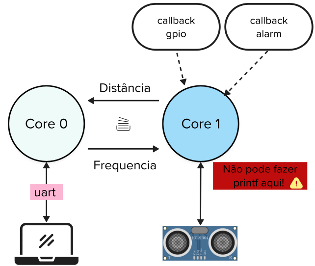

# Expert - firmware - Multi core

::::: center
:::: third 
::: box-blue 1. Classroom
[:memo: Prática](https://classroom.github.com/a/5Xy3fY7o)
:::
::::
:::: third
::: box-yellow 2. Entrega final
[Enviar no PrairieLearn](https://us.prairielearn.com/pl/course_instance/210559)
:::
::::
:::: third
::: box Nota
70% da nota do laboratório
:::
::::
:::: third
::::
:::::

Neste laboratório, iremos desenvolver uma aplicação que utiliza os dois núcleos de processamento da Raspberry Pi Pico.

## Laboratório

Trabalharemos com o modelo de execução multicore, no qual cada **core** da Pico será responsável por uma parte específica do sistema. A comunicação entre os núcleos será realizada por meio da **FIFO de sincronização** disponibilizada pelo hardware.

A proposta é expandir o **LAB-3-pra**, distribuindo as responsabilidades da seguinte forma:

1. **Core 0**:  
   - Leitura da UART  
   - Implementação do protocolo de comunicação com o PC  

2. **Core 1**:  
   - Leitura do sensor ultrassônico **HC-SR04**

Conforme ilustrado no diagrama abaixo:

## FIFOs

No diagrama, observe que o `Core 0` e o `Core 1` se comunicam por meio das **FIFOs de sincronização**. Elas serão utilizadas para:

- **Core 0 → Core 1**: envio da frequência de leitura do sensor  
- **Core 1 → Core 0**: envio da distância medida  

::: box-blue Pensar
Alguns problemas que precisam ser resolvidos:

1. Como sinalizar ao `Core 1` que a leitura deve ser interrompida (por exemplo, ao receber o comando `stop`)?
2. Como o `Core 1` deve informar ao `Core 0` que ocorreu um erro na leitura do sensor?
:::

::: box
Lembrem que as FIFOs utilizadas no processador rp2350 são de 32 bits.
:::

## Printfs

Devido às características das funções da biblioteca `stdio` (`printf`, `scanf`, etc.), não é possível utilizá-las simultaneamente em diferentes núcleos, pois **não são [reentrantes](https://pt.wikipedia.org/wiki/Reentr%C3%A2ncia)**.

Por esse motivo, recomenda-se que apenas o `Core 0` seja responsável pelas operações de `printf` e `scanf`.
