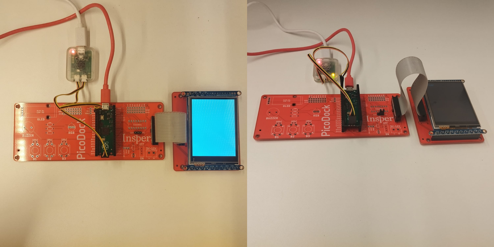
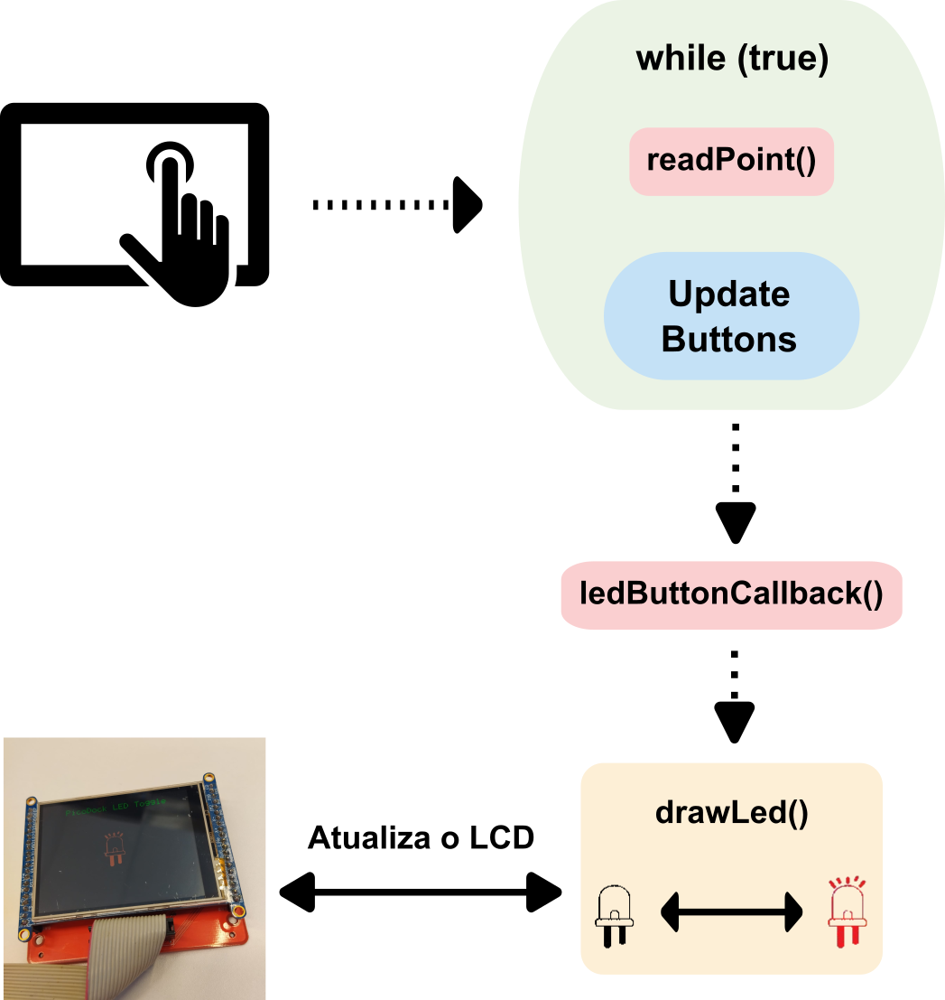
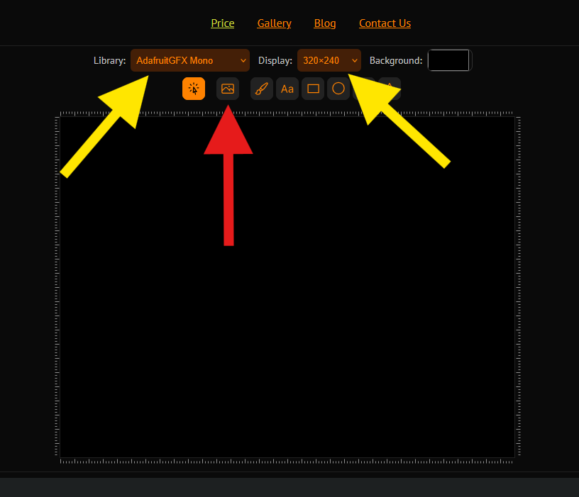
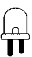
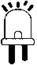
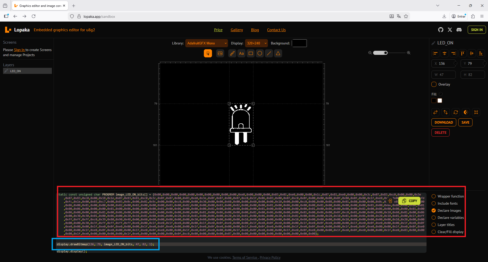

# Expert - ili9341 com Touch Resistivo

::::: center
:::: third 
::: box-blue 1. Classroom
[:memo: Prática](https://classroom.github.com/a/5Xy3fY7o)
:::
::::
:::: third
::: box-yellow 2. Entrega final
[Enviar no PrairieLearn](https://us.prairielearn.com/pl/course_instance/210559)
:::
::::
:::: third
::: box Nota
70% da nota do laboratório
:::
::::
:::: third
::::
:::::

Neste laboratório, iremos aprender a utilizar funções do display LCD com driver ili9341 em conjunto com o módulo de touch resistivo.

::: warning Placa Adaptadora para o LCD
Desenvolvemos duas placas (PicoDock / TFT LCD Dock) que facilitam as conexões da Raspberry Pi Pico com o LCD ili9341:

{width=800px}
:::


::: box-red LEITURA

Antes de seguir no laboratório será necessário ler o material:

- [Sobre LCD](/guides/lcd-ili-gfx)
:::


## Definições

Neste laboratório iremos trabalhar com o display LCD TFT ili9341 e com o módulo de **Touch Resistivo**, permitindo que a aplicação possua saída gráfica e também interação com o usuário.

Com o LCD podemos exibir mensagens e informações na tela, escrever textos em diferentes posições e tamanhos, desenhar formas geométricas como retângulos, círculos e linhas, renderizar imagens (bitmaps) e criar interfaces gráficas simples.

Com o **touch resistivo**, podemos detectar a posição do toque na tela, criar áreas interativas como botões, desenvolver menus e interfaces gráficas e implementar aplicações com interação direta do usuário.

## Demonstração


No link para o repositório abaixo está o exemplo que vamos utilizar (LED_TOGGLE):

https://github.com/insper-embarcados/pico-lcd-ili9341


O código de demonstração possui o seguinte fluxo:

{width=800px}

## Dicas

- Os bitmaps dos estados ON e OFF do LED foram gerados através do site:

https://lopaka.app/sandbox

Na imagem abaixo você deve fazer a configuração conforme indicado pelas setas amarelas

{width=800px}

A seta vermelha é o botão que em que você importa a imagem, abaixo estão ambas as imagems (.bmp) utilizadas:

{width=40x}

{width=40px}

Após a importação é retornado o Bitmap gerado e também a função drawBitmap, já setada com o bitmap, tamanho e posição na tela.

{width=40px}

- VERMELHO: Bitmap contendo os valores

- AZUL: Função drawBitmap contendo informações do tamanho da imagem gerada e posiçao na tela

```c

drawBitmap(
    136,                //Posição horizontal da imagem
    79,                 //Posição vertical da imagem
    image_LED_ON_bits,  //Ponteiro para os dados do bitmap da imagem
    47,                 //Largura da imagem (width)
    82,                 //Altura da imagem (height)
    1                   //Cor da imagem (1 para cor definida, 0 para transparente)
);

```

Após isso, basta:

- Abrir o arquivo image_bitmap.h e colar o vetor Bitmap
- No main.c modificar as variáveis que solicitção os tamanho de WIDTH e HEIGHT da __imagem__

::: warning ATENÇÃO!!!

- O site gera um vetor do tipo **static const unsigned char PROGMEM**, no nosso exemplo utilizamos **static const uint8_t**, como pode ser visto no código exemplo.

:::

## Laboratório

O desafio desse laboratório é criar uma interface para controntolar o motor de passos, com os seguintes recursos:

Botões:

    - girar sentido horário
    - girar sentido anti-horário

Animações: 

    - Enquanto o motor estiver girando, o LCD deverá exibir uma animação indicando para qual sentido o mesmo está girando
    


