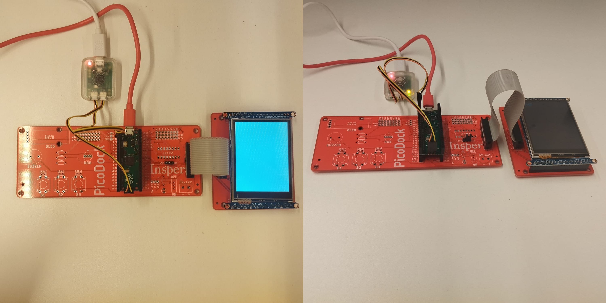

# Expert - ili9341 com Touch Resistivo

Neste laboratório, iremos aprender a utilizar funções do display LCD com driver ili9341 em conjunto com o módulo de touch resistivo.

::: warning Placa Adaptadora para o LCD
Desenvolvemos duas placas (PicoDock / TFT LCD Dock) que facilitam as conexões da Raspberry Pi Pico com o LCD ili9341:

{width=800px}
:::

Antes de seguir no laboratório será necessário ler o material:

:::: center
::: third  📖 [ILI9341](/guides/lcd-ili-gfx)
:::

::: third  📖 [Lopaka](/guides/lcd-lopaka)
:::
::::

::: info Código base
Você deve utilizar o código do repositório a seguir para realizar o lab, copie os arquivos para o repositório criado para entrega.

-  https://github.com/insper-embarcados/pico-lcd-ili9341
:::

## Definições

Neste laboratório iremos trabalhar com o display LCD TFT ili9341 e com o módulo de **Touch Resistivo**, permitindo que a aplicação possua saída gráfica e também interação com o usuário.

Com o LCD podemos exibir mensagens e informações na tela, escrever textos em diferentes posições e tamanhos, desenhar formas geométricas como retângulos, círculos e linhas, renderizar imagens (bitmaps) e criar interfaces gráficas simples.

Com o **touch resistivo**, podemos detectar a posição do toque na tela, criar áreas interativas como botões, desenvolver menus e interfaces gráficas e implementar aplicações com interação direta do usuário.

## Laboratório

O desafio desse laboratório é criar uma interface para controntolar o motor de passos, com os seguintes recursos (do LCD):

Botões:

- girar sentido horário
- girar sentido anti-horário

Animações: 

- Enquanto o motor estiver girando, o LCD deverá exibir uma animação indicando para qual sentido o mesmo está girando
    
