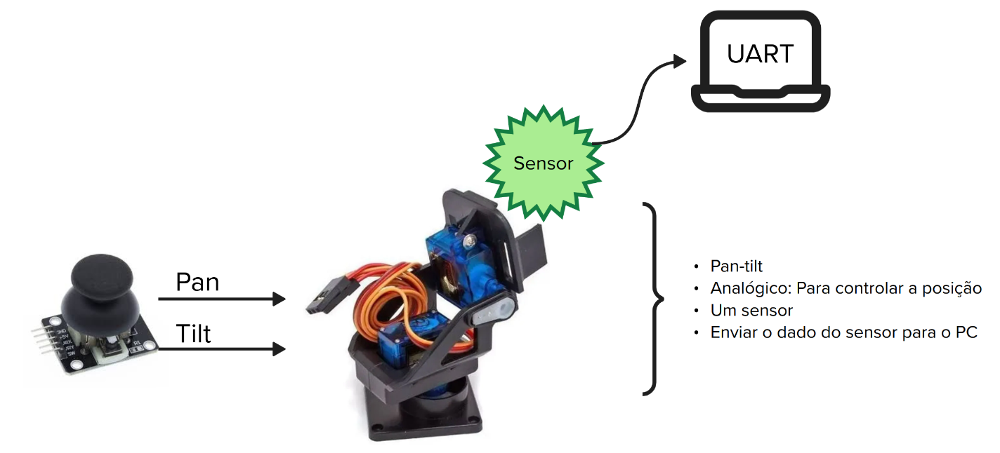

# Expert - PPM - IHM

Neste laboratório, iremos criar um sistema embarcado capaz de ajustar a posição de **um conjunto pan-tilt (dois servomotores)** através de **uma interface gráfica no PC**, além de exibir em **tempo real o gráfico da leitura de um sensor analógico**.

## Lab



Sistemas embarcados têm a função de **perceber e interagir com o mundo físico**, lendo sensores e controlando atuadores.  
Esse processo, embora essencial, é frequentemente desafiador — envolve lidar com **dispositivos externos de diferentes tipos**, cada um com **interfaces elétricas, protocolos e comportamentos próprios**.

Exploraremos esse universo de forma prática, desenvolvendo soluções que integram **aferição, controle e comunicação**. Você deverá criar um sistema embarcado completo, que une:
- **Controle de posição** utilizando servomotores (mecanismo Pan-Tilt);
- **Monitoramento de sensores analógicos** para capturar grandezas físicas;
- e uma **interface homem-máquina (IHM)** no PC, que permite visualizar e comandar o sistema em tempo real.

O objetivo é proporcionar uma visão integrada do ciclo completo de um sistema embarcado — da leitura do sensor até o controle preciso do atuador, com feedback visual e interação pelo usuário.

### Servomotor

Um **servomotor** é um atuador de posição com malha fechada interna, que se move automaticamente até o ângulo solicitado. É amplamente utilizado em aplicações como:

- Controle de direção de carrinhos e robôs
- Posicionamento de câmeras
- Fechaduras e mecanismos automáticos

Para entender o funcionamento detalhado, consulte:
- [Dispositivos/Servomotor](/guides/dispositivos-servo)

### Sensores Analógicos

O sistema deve incluir ao menos **um sensor analógico** adicional, cuja leitura será enviada para o PC e exibida graficamente em tempo real.  
Exemplos de sensores disponíveis:

- [LDR](https://insper-embarcados.github.io/site/guides/dispositivos-analogicos.html#ldr)
- [Termistor NTC](https://insper-embarcados.github.io/site/guides/dispositivos-analogicos.html#termistor-ntc)
- [Strain gauge](https://insper-embarcados.github.io/site/guides/dispositivos-analogicos.html#strain-gauge)
- [SHARP](https://insper-embarcados.github.io/site/guides/dispositivos-analogicos.html#sharp)

Consulte mais opções em:
- [Dispositivos/Analógicos](/guides/dispositivos-analogicos)

---

### Interface Gráfica

A **Interface Homem-Máquina (IHM)** é o elo entre o usuário e o sistema embarcado.  
Neste laboratório, o foco é desenvolver uma **interface gráfica (GUI)** no **PC** capaz de interagir, em tempo real, com o sistema embarcado via **UART**.

Essa interface será responsável por:
- **Enviar comandos de controle** aos servomotores (pan e tilt);
- **Exibir graficamente os dados dos sensores analógicos**;
- e **fornecer feedback visual** sobre o estado do sistema.

A IHM deve permitir uma **interação intuitiva**, oferecendo ao usuário uma visualização clara do comportamento do sistema físico. Ela pode ser desenvolvida em **[Processing](https://www.youtube.com/watch?v=3Hllo71SGUk)** ou **Python**, conforme sua preferência e familiaridade.

#### Funções principais da interface

1. **Controle dos servomotores (Pan e Tilt)**  
   - Deve possuir **sliders** ou **botões** que permitam ao usuário ajustar a posição de cada eixo.  
   - A interface deve enviar os ângulos desejados ao microcontrolador via UART, permitindo o controle suave e preciso do mecanismo pan-tilt.

2. **Plotagem de dados do sensor**  
   - A IHM deve exibir **em tempo real** o gráfico da leitura de um sensor analógico.  
   - O gráfico deve ser continuamente atualizado à medida que os dados são recebidos do sistema embarcado.

#### Sugestões de implementação

- **Python**  
  - Utilize `PySerial` para comunicação e `Matplotlib` ou `PyQtGraph` para exibir o gráfico em tempo real.  
  - Para construir a interface visual, pode usar `Tkinter` ou `PyQt5`.

- **Processing**  
  - **Processing** é uma linguagem e um ambiente de programação voltado à criação de **interfaces gráficas e aplicações visuais interativas**.  
  - Ele é amplamente utilizado em conjunto com o **Arduino**, pois ambos compartilham uma filosofia educacional e uma sintaxe muito semelhante baseada em **C/C++**.  
  - Essa integração facilita a comunicação entre o computador e a placa. Nessa relação, o **Arduino** executa o controle do hardware (como leitura de sensores e acionamento de servomotores), enquanto o **Processing** roda no **PC** e atua como a **Interface Homem-Máquina (IHM)**, permitindo **enviar comandos, visualizar dados e criar controles interativos**.  
  - Abaixo há um vídeo demonstrando o desenvolvimento de uma aplicação utilizando **Processing + Arduino**:

  https://www.youtube.com/watch?v=3Hllo71SGUk


## Requisitos

Requisitos do laboratório:

1. **Construir um mecanismo Pan-Tilt** utilizando **dois servomotores**.
2. **Controlar o Pan-Tilt** através de uma **Interface Homem-Máquina (IHM)** no **PC** — implementada em **Python** ou **Processing**.
3. **Ler e processar pelo menos um sensor analógico** adicional (por exemplo, LDR, termistor NTC, strain gauge ou SHARP).
4. **Transmitir as leituras do sensor via UART** para a interface gráfica, com atualização em tempo real.
5. **Receber comandos de controle via UART** enviados pela IHM para ajustar a posição dos servos.
6. **Implementar o sistema sob RTOS**, utilizando *tasks*, *queues* e *semáforos* para organizar:
   - Controle dos servos;
   - Aquisição dos sensores;
   - Comunicação serial.
7. Garantir que o **gráfico de leitura do sensor** seja atualizado continuamente na IHM, representando o comportamento dinâmico da variável medida.
8. **Documentar o sistema** (hardware e software) com diagrama de blocos e explicação do fluxo de dados entre microcontrolador ↔ PC.

---

### Dicas

- **Imprima o suporte Pan-Tilt** (sugestão: [Thingiverse - Pan Tilt](https://www.thingiverse.com/thing:708819)).
- Implemente uma comunicação UART para enviar e receber dados da Pico:
```
PAN:ppp - TILT:ttt: indica a posição dos servomotores em graus 000° e 179°
SENSOR:sss : Indica a leitura do sensor (leitura direta do valor analógico, sem ou com tratamento)
```
- Implementar o sistema com RTOS.


