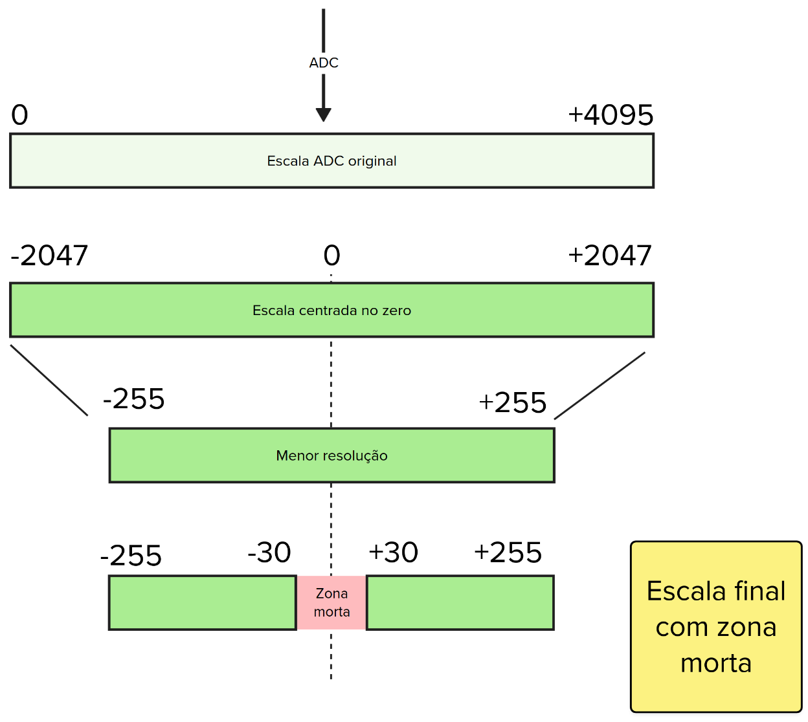

# Lab 5 - ADC, PWM - Prática <Badge type="tip" text="70% da nota do lab" />

::::: center
:::: third 
::: box-blue 1. Classroom
[:memo: Prática](https://classroom.github.com/a/qt4pjBeh) 
:::
::::
:::: third
::: box-yellow 2. Entrega final
[Enviar no PrairieLearn](https://us.prairielearn.com/pl/course_instance/210559)
:::
::::
:::: third
::: box Nota
70% da nota do laboratório
:::
::::
:::: third
::::
:::::

Neste laboratório iremos usar um joystick analógico para implementar um "mouse".

Para isso, você vai precisar de:

| Lista de Materiais   | Valor    |
|----------------------|----------|
| 1x JY-023 (joystick) | R$ 8,00 |

## Requisitos

Fazer a leitura de um joystick, formatar os dados corretamente e enviar via serial para a leitura do programa python.


## Python

Para executar esse laboratório, você terá que utilizar um programa Python localizado em:

- https://github.com/insper-embarcados/python-mouse

::: info
Consulte o README do repositório para informações de como instalar e executar o programa.
:::

No repositório está sendo fornecido um programa Python (`python/main.py`) que faz a leitura da porta UART e processa os dados para movimentar o mouse. Para que isso funcione corretamente, será necessário enviar os dados no seguinte formato:

```
AXIS VAL_1 VAL_0 EOP
```

Onde cada um dos termos do datagrama é composto por 8 bits que indica:

- `AXIS`: 0 ou 1 para indicar eixo `X` ou eixo `Y`.
- `VAL_0`: Byte ==menos significativo== (LSB) do valor do movimento do eixo
- `VAL_1`: Byte ==mais significativo== (MSB) do valor do movimento do eixo
- `EOP`: -1 indica fim de pacote

Exemplo:

- Movimentar o mouse no eixo X para a posição 845 (direita)

`00000000 01001101 00000011 11111111`

> Notem que o valor de 845 em binário é: `00000011 01001101`!

- Movimentar o mouse no eixo Y para a posição -55 (baixo)

`00000001 11001001 11111111 11111111`

> Notem que o valor de -55 em binário é: `11111111 11001001`!

## Firmware

Para garantir a integridade do sinal analógico, você deve aplicar uma média móvel antes de enviarem o dado para a uart. Para isso iremos estruturar o firmware da seguinte maneira:

{width=800}

Onde:

- `x_task` e `y_task`: Fazem a leitura e **implementam a média móvel** do valor analógico
- `xQueueADC`: ID (`1` / `0`) e dados filtrados para serem transmitidos
- `uart_task`: Faz o envio dos dados pela UART

## Dicas

A seguir, dicas sobre como executar o lab:

### Conexão

Alimentar o módulo com `ADC_VREF` da PICO.
	
{width=250px height=100px}

<!--

###  KY-023 (joystick)

Esse joystick é composto por 2 potênciometros e um  push button encapsulados em no mesmo componente. Os potenciômetros possuemuma curva anti logarítmica, ou seja, o centro do mesmo não representa 50% do valor da resistência, como representado no gráfico abaixo:


No gráfico da linear, linha roxa, metade do giro corresponde a metade da resistência. Já no da anti logarítmica, vermelha, repare como no começo do giro a progressão da resistência é rapida e brusca, e no final ela se torna bem lenta.

!!! info "Log para Linear"
    Crie uma função que convertar o valor lido (curva logarítimica) em um valor linear, ou seja, quando o joystick estiver em respouso (ambos os eixos centralizados), o valor lido pelo ADC deverá ser 50% da escala de 0 a 4095, ou seja, aproximadamente 2047.
-->

### Dados

Para o mouse funcionar corretamente, devemos obter um valor `0` quando ele estiver parado e um valor positivo para mover, por exemplo, para a direita (se for o eixo `x`) e um valor negativo para mover para a esquerda. Ou seja, vamos ter que mudar a escala da leitura analógica de `0 ... 4095` para `-255 ... +255` e com uma zona morta, como indicado a seguir:



::: danger "Zona morta"
A zona morta define um valor que não deve ser enviado para o Python, ou, se enviado, o valor deve ser sempre 0. Isso é necessário devido às variações mecânicas que o potenciômetro possui, pois quando solto, seu valor não é necessariamente 2095.
:::

### `xQueueADC` 

A fila `xQueueADC` deverá ser uma fila de `structs` para que possamos separar se os dados pertencem ao eixo `x` ou `y`. Para isso, sugerimos criar a seguinte `struct`:

```c
typedef struct adc {
    int axis;
    int val;
} adc_t;
```

::: info
Não sabe como enviar uma struct para a fila? Consulte a página da disciplina:
    
- [Freertos/Queue Struct](/guides/freertos-queue-advanced)
:::
