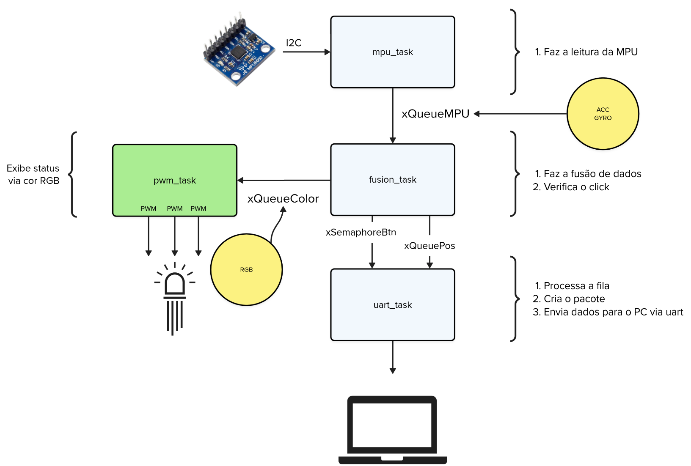

# Lab 7 - I2C - Prática <Badge type="tip" text="70% da nota do lab" />

Neste laboratório iremos substituir o joystick analógico por uma IMU para implementarmos um "pointer" (esses usados para apresentacão!). Como o [spotlight da logitech]( https://www.logitech.com/pt-br/products/presenters/spotlight-presentation-remote.910-005216.html). 

<YouTube id="8C9EGM1Bh3c"/>

Para isso, vocês precisarão de:

| Lista de Materiais | Valor    |
|--------------------|----------|
| 1x MPU6050         | R$ 20,00 |
| 1x LED PWM         | R$ 0,50  |

::: info
Você devem utilizar o mesmo python do lab passado (porém vão precisar alterar ele).
:::


- `mpu_task`: Faz a leitura da aceleracao e do giroscópio e envia os dados para a fila `xQueueMPU`
- `xQueueMPU`: Fila que possui os dados de aceleração e de giroscópio
- `fusion_task`: Task que faz a fusão de dados, detecta o click e formata a cor
- `xQueueColor`: Fila que recebe um dado `rgb` e exibe no LED (via pwm)
- `xQueuePos`: Fila que possui os dados `x` e `y` que irão movimentar o mouse
- `xSemaphoreBtn`: Semáforo que indica que o botão foi pressionado
- `uart_task`: Task que faz o envio dos dados para UART

## Requisitos

No lugar do joystick, agora você deve fazer a leitura da `IMU6050` formatar os dados corretamente e enviar via serial para a leitura do programa python.

Vocês precisarão implementar um "mouse click", que deve ser acionado quando o sistema embarcado perceber uma movimentação repentina na horizontal no sentido para frente, como se estivesse "cutucando o ar". Para isso vão precisar identificar esse tipo de movimentação e fazer o envio para o python (que deverá ser modificado).

Além do mouse click, você deverão implementar o controle de um led RGB que deverá mudar de cor dado a orientacão do controle.

Siga o diagrama detalhado a seguir:



## Firmware fornecido

O Firmware fornecido é inspirado no exemplo [oficial da raspberrypi](https://github.com/raspberrypi/pico-examples/tree/master/i2c/mpu6050_i2c) pico para o sensor MPU6050, modificado para fazer uso do Freertos, a conexão deve ser a mesma da indicada no repositório do fabricante:


O firmware faz leituras periódicas do sensor e imprime os valores de aceleração, giro e temperatura (interna do chip) no terminal:

```c
while(1) {
    mpu6050_read_raw(acceleration, gyro, &temp);

    vTaskDelay(pdMS_TO_TICKS(10));
}
```

::: warning
Se você for utilizar a PICO DOCK, você deve alterar os pinos do I2C:

```diff
-const int I2C_SDA_GPIO = 4;
-const int I2C_SCL_GPIO = 5;

+const int I2C_SDA_GPIO = 17;
+const int I2C_SCL_GPIO = 16;
```

E utilizar esses pinos novos para conectar a MPU6050.

Os pinos originais 4 e 5 estão conectados aos botões da placa, e nesse botões colocamos um capacitor para realziar o deboucing, por conta disso o barramento I2C não funciona!
:::

::: tip 
Execute o código exemplo fornecido, abra o terminal e verifique se ele funciona (envia dados na UART).

- Analisando os dados enviados, você é capaz de extrair alguma infomaćão?
:::

## Fusão de dados

Os dados brutos de aceleração e giro não são muito fáceis de se usar, pois precisam ser "fundidos" para fornecerem informacoes mais úteis, uma dessas informacoes que podemos obter da fusão dos dados é chamada de "orientacão" (`roll, pitch e yaw`).


Existem diversos algortímos que realizam essa fusão de dados, e IMUs mais poderosas podem fazer isso internamente, mas não é o caso da nossa (IMUs que fazem fusão são um pouco mais caras!). Para obtermos a orientacão iremos usar uma biblioteca escrita em C para sistemas embarcados chamada de [xioTechnologies/Fusion](https://github.com/xioTechnologies/Fusion). A biblioteca já foi importada para vocês no projeto, mas ainda não foi utilizada.

A lib que iremos utilizar é a:

- https://github.com/xioTechnologies/Fusion/blob/main/Examples/Simple/main.c

A seguir um exemplo de como ler a MPU e realizar a fusão dos dados:

```c
void mpu6050_task(void *p) {
  // .... 
  // configuracao da mpu e i2c

  FusionAhrs ahrs;
  FusionAhrsInitialise(&ahrs);
  
  while (true) { 

      mpu6050_read_raw(acceleration, gyro, &temp);
      FusionVector gyroscope = {
          .axis.x = gyro[0] / 131.0f, // Conversão para graus/s
          .axis.y = gyro[1] / 131.0f,
          .axis.z = gyro[2] / 131.0f,
      };

      FusionVector accelerometer = {
          .axis.x = acceleration[0] / 16384.0f, // Conversão para g
          .axis.y = acceleration[1] / 16384.0f,
          .axis.z = acceleration[2] / 16384.0f,
      };      
  
      FusionAhrsUpdateNoMagnetometer(&ahrs, gyroscope, accelerometer, SAMPLE_PERIOD);
  
      const FusionEuler euler = FusionQuaternionToEuler(FusionAhrsGetQuaternion(&ahrs));
  
      printf("Roll %0.1f, Pitch %0.1f, Yaw %0.1f\n", euler.angle.roll, euler.angle.pitch, euler.angle.yaw);
      vTaskDelay(pdMS_TO_TICKS(10));
  }
```

::: warning Atenção!
- Notem que a lib necessita saber a taxa de amostragem! `SAMPLE_PERIOD`, vocês precisam ajustar com o valor de vocês!
- Esse exemplo não faz uso de bussolá (pois nossa IMU não possui), isso acrescenta um *drift* no resultado, ou seja, mesmo com a IMU parada vamos notar um "movimento" (a bussolá tenta corrigir isso). 
:::

## LED RGB

O LED RGB possibilita que tenhamos uma combinação de cores para representar o estado de orientação do controle de forma visual e imediata.
O objetivo final é que o LED RGB funcione como uma extensão da interface: além de enviar os dados para o Python e detectar o clique, o sistema também deve comunicar visualmente a orientação do dispositivo.

Para isso vocês deverão controlar as cores do LED a partir dos ângulos de `roll` e `pitch` calculados pela fusão de dados. A ideia é que o LED funcione como um indicador intuitivo da inclinação do dispositivo, permitindo que a cor mude conforme o controle é inclinado para diferentes direções.

Uma sugestão de mapeamento é:

- inclinação para a esquerda: aumentar o componente azul;
- inclinação para a direita: aumentar o componente vermelho;
- inclinação para frente: aumentar o componente verde;

Vocês podem escolher a estratégia de mapeamento que fizer mais sentido, desde que a cor varie de forma consistente com a orientação do controle. O importante é que a relação entre orientação e cor seja perceptível e reproduzível.

Como o LED é do tipo RGB, será necessário controlar os três canais independentemente por LED. Também é interessante suavizar as transições de cor, para que o LED não fique “pulando” entre tons muito diferentes a cada amostra (podem usar a média móvel).

## Python

Vocês devem modificar o programa em python para que ele identifique quando houve um click do mouse e "aperte" o botão.
