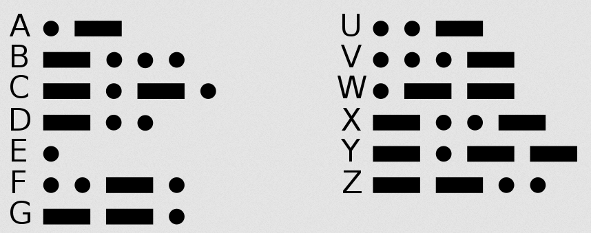

# Lab 2 - ISR - Prática <Badge type="tip" text="70% da nota do lab" />

::::: center
:::: third 
::: box-blue 1. Classroom
[:memo: Prática](https://classroom.github.com/a/xGXQxdMg)
:::
::::
:::: third
::: box-yellow 2. Entrega final
[Enviar no PrairieLearn](https://us.prairielearn.com/pl/course_instance/188020)
:::
::::
:::: third
::: box Nota
70% da nota do laboratório
:::
::::
:::: third
::::
:::::

Neste laboratório, aplicaremos os conceitos de Interrupção de Hardware/GPIO (IRQ). Como desafio, vamos desenvolver um telégrafo digital!

<YouTube id="hIN1wH4iYdg"/>

<YouTube id="L6gxfX4GrbI"/>

## Material

Para isso, você vai precisar de:

| Lista de Materiais   | Valor   |
|----------------------|---------|
| 2x Botões de pressão | R$ 0,20 |
| 1x Buzzer            | R$ 2,70 |

O buzzer é um dispositivo piezoelétrico capaz de vibrar quando acionado corretamente (leia mais em [Consulta/Buzzer](/guides/dispositivos-buzzer)). Com ele, seremos capazes de gerar o tom necessário para simular o telégrafo e reproduzir um código Morse:

<figure>
    <figcaption>Hello World</figcaption>
    <audio
        controls
        src="/labs/imgs/lab_irq_pra_morse.wav">
            Seu navegador não suporta o elemento
            <code>audio</code>.
    </audio>
</figure>

Note que existem dois tipos de sinal: curto e longo. O desafio deste laboratório será gerar automaticamente esses dois tons.

## Requisitos

Seu projeto deve possuir dois botões (`btn1` e `btn2`) e um buzzer. Cada botão deve reproduzir um tom diferente (indicamos `freq1` e `freq2`). O código deve fazer uso de IRQ para a leitura dos botões. O `btn1` deve reproduzir `freq1` por um determinado tempo, e o `btn2` deve reproduzir `freq2` por um tempo três vezes maior que o do outro botão. A ideia é que não precisemos contar o tempo na nossa cabeça (curto/longo); o sistema faz isso por nós!

| Parâmetro | valor   |
|-----------|---------|
| `freq1`   | 1000 hz |
| `time1`   | 100 ms  |
| `freq2`   | 6000 hz |
| `time2`   | 300 ms  |

Resultado esperado:

<YouTube id="sH9y-UITTTo"/>

### Dicas

A seguir, algumas dicas de como fazer. Você pode ou não seguir:

1. Comece pelos botões e suas IRQs
2. Reproduza um som no `buzzer`
3. Crie uma função que recebe uma `frequência`, `tempo` e um `pino` e reproduz um tom.
4. Implemente a lógica

::: tip
Não se esqueça de verificar o code quality! Agora ele vai começar a apitar na cabeça de vocês!
:::

## Desafios extras

Gostou e quer fazer mais? Que tal:

1. Olhando para o futuro... Dê uma olhada no `RP2040/Timer` e tente usar o periférico do timer para contar tempo!
2. Entre cada tom deve haver um silêncio. Se o usuário pressionar muito rápido cada botão, insira o silêncio automaticamente.
3. Adicione dois buzzers e gere um tom composto (cada som é composto por duas notas)
4. Receba um texto via [`UART`](/guides/pico-uart), converta para código morse e transmita!
   - Pode usar comandos básicos de `c` e leitura de terminal!
