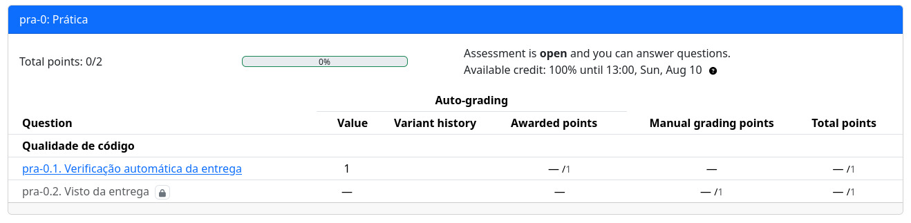

# Laboratório prático

As atividades de laboratório demandam que vocês utilizem a placa física, e a entrega é composta por duas frentes:

- Mostrar o projeto funcionando.
- Código livre de erros de qualidade de código.

## Infra

Ao longo do semestre utilizaremos uma série de softwares, sendo eles:

- PrairieLearn
- Vscode
- python
- git e github

A disciplina pode ser realziada em qualquer sistema operacional (Linux, Windows, Mac) e em qualquer arquitetura (x86 e ARM).

::: highlight Linux
Você está no Linux? Vai precisar configurar algumas coisas para que tudo funcione bem.

> Só damos suporte para ubuntu.

1. Primeiro instale os pacotes a seguir:

```
sudo apt install libjim-dev libjim0.79 openocd gdb-multiarch libftdi1-2 libhidapi-hidraw0
```

2. Usar o comando `sudo gedit  /etc/udev/rules.d/60-openocd.rules` que vai criar um arquivo e coloca o [ESSE CONTEUDO](https://github.com/raspberrypi/openocd/blob/sdk-2.0.0/contrib/60-openocd.rules) no arquivo criado.

Agora reinicie o computador!
:::

# Depurador

No curso iremos usar o [debug-probe](https://www.raspberrypi.com/documentation/microcontrollers/debug-probe.html), um dispositivo criado para podermos gravar, depurar e ter acesso à saída UART da Raspberry Pi Pico.

Primeiro, faça a conexão como indicado a seguir:

::: info
    Note a necessidade de dois cabos USB!
:::


:::tabs
== tab Montagem
{width=400}
== tab Imagem

:::


## Validando qualidade de código

As entregas práticas também devem respeitar a qualidade de código. Os repositórios que serão criados no classroom estarão com a verificação ativada.


## Validando prática

Vocês possuem uma semana para terminar o lab e apresentar o projeto montado e funcionando para alguém da equipe. Consulte os **horários disponíveis** para apresentar o laboratório.

| Horário         | Segunda-feira | Terça-feira    | Quarta-feira | Quinta-feira | Sexta-feira   |
|-----------------|---------------|----------------|--------------|--------------|---------------|
| **09:15-09:30** |               |                |              |              | Marco (Arq)   |
| **09:45-12:00** | Marco  (Arq)  |                | Corsi (Arq)  |              |               |
| **13:40-14:20** | Marco  (Arq)  |                | Corsi (Arq)  |              |               |
| **16:30-18:20** |               |                |              | Marco (Arq)  |               |
| **18:30-21:00** |               | Daniel  (Agil) | Corsi (Arq)  |              | Daniel (Agil) |

- (Arq): Laboratório de arquitetura
- (Ágil): Laboratório Ágil 2

Lembrando que:

- Os laboratórios práticos possuem nota binária: Um ou Zero
- Para validar a entrega vocês devem:
    - Entregar código no GitHub (sem falhas de qualidade de código)
    - Apresentar protótipo funcionando até a data limite

## Enviando para avaliação 

De forma similar ao laboratório preparatório, o prático também deve ser enviado ao PL. Nesse caso, são duas entregas: uma que indica que o firmware não possui erros de qualidade de código; a entrega da atividade prática estará bloqueada enquanto a qualidade de código não for validada, como indicado a seguir:



A segunda etapa da entrega é conseguir o badge de avaliação de alguém da equipe técnica. A entrega só será confirmada quando vocês subirem uma imagem da placa com o badge de avaliação.
