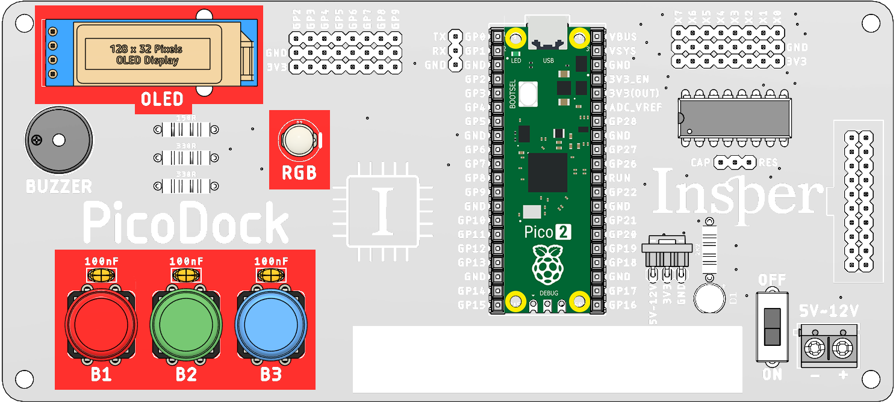

# Lab 4 - RTOS - Prática <Badge type="tip" text="70% da nota do lab" />

::::: center
:::: third 
::: box-blue 1. Classroom
[:memo: Prática](https://classroom.github.com/a/sr3gGsvt ) 
:::
::::
:::: third
::: box-yellow 2. Entrega final
[Enviar no PrairieLearn](https://us.prairielearn.com/pl/course_instance/188020)
:::
::::
:::: third
::: box Nota
70% da nota do laboratório
:::
::::
:::: third
::::
:::::

::: warning
Agora surgem novas regras, consulte a página: [Regras RTOS](/guides/qualidade-rtos) para saber as regras que serão aplicadas.

Cuidado! As antigas ainda continuam valendo!
:::

## Pico Dock

A [pico-dock](/guides/picodock-index) é um projeto interno do laboratório que viza facilitar o uso de componentes externos a rasp pico, minimizando o trabalho de termos que conectar coisas a pico e agilizando o processo de desenvolvimento de projetos.

Nesse laboratório iremos utilizar três grupos de componentes dessa placa:

- Botões
- LED RGB
- Display OLED



Para facilitar ainda mais o uso, estamos disponibilizando um projeto exemplo no repositório dessa entrega que mostra como fazer uso desses componentes. O projeto exemplo fornecido possui um RTOS e uma `task` que inicializa os botões, LED e OLED e para cada botão apertado exibe o seu valor.

## Entrega

Vamos mexer novamente com o sensor de `ultrassom`, só que agora iremos estruturar o código para operar com `rtos` e exibir o resultado no OLED. 

::: info
Você deve seguir necessáriamente a estrutura proposta a seguir
:::

A estrutura do código que deve ser entrega, deve seguir o diagrama a seguir, onde:

- `pin_callback`: Função callback do pino do echo.
- `trigger_task`: Task responsável por gerar o trigger.
- `echo_task`: Task que faz a leitura do tempo que o pino `echo` ficou levantado.
- `oled_task`: Task que exibe a informação da distancia no display.
    - Faz uso de dois recursos, `xSemaphoreTrigger` e `xQueueDistance`

Recursos:
    
- `xQueueTime`: Fila com informação do tempo `to_us_since_boot`
- `xSemaphoreTrigger`: Avisa o OLED que uma leitura foi disparada
- `xQueueDistance`: Valor da distância em cm lido pela `task_echo`


::: tip
1. Utilize o timeout da `xQueueDistance` para identificar quando houve falhar no sensor!

```c
if (xQueueReceive(xQueueDistance, &time,  pdMS_TO_TICKS(100))) {
    // Se caiu aqui é pq o dado chegou no tempo certo
} else {
    // Se caiu aqui é pq o dado não chegou! Erro no sensor
}
```

**Você deve pensar no valor do timeout: `pdMS_TO_TICKS(xxx)`!!**

> Bem mais fácil que usar um timer para calcular o timeout!!

2. O HS-SR04 pede para gerarmos um pulso de 10us no triger, o valor mínimo que conseguimos no `vTaskDelay` é de 1ms! Então nesse caso 
:::

### Display

Você deve exibir no display:

- Se o sensor falhou.
- O valor da distância, quando executada.
- Uma barra que representa a distância.

### LED

Exibir no LED: 

- Verde: Se o objeto está até 1m de distância.
- Amarelo: Se o objeto está a mais de 1m de distância.
- Vermelho: Se o sensor está com falha.
