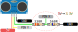
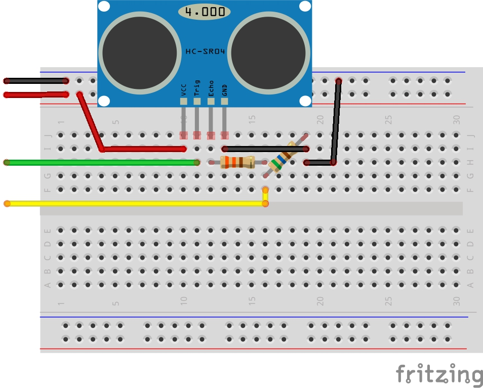

# Lab 3 - Timer - Prática <Badge type="tip" text="70% da nota do lab" />

::::: center
:::: third 
::: box-blue 1. Classroom
[:memo: Prática](https://classroom.github.com/a/cye3AyRV)
:::
::::
:::: third
::: box-yellow 2. Entrega final
[Enviar no PrairieLearn](https://us.prairielearn.com/pl/course_instance/188020)
:::
::::
:::: third
::: box Nota
70% da nota do laboratório
:::
::::
:::: third
::::
:::::

Neste laboratório, aplicaremos os conceitos de timer para realizar a leitura de um sensor de distância e criar um datalogger.

<YouTube id="QOc4vgqFXS0"/>

## Materiais

Para isso, você vai precisar de:

| Lista de Materiais | Valor    |
|--------------------|----------|
| 1x HC-SR04         | R$ 14,00 |
| Resistores         |          |

## Lab

::: success Qualidade de código
Não se esqueça de já programar pensando na qualidade de código! Agora ele vai começar a apitar na cabeça de vocês!
:::

O sistema deve fazer a interface com o módulo de ultrasom, fazer a leitura de forma periódica e enviar os valores pela UART. Além disso, o sistema deve poder ser configurado via um terminal.

### HC-SR04

**O sensor opera com tensão de 5V, mas nossa placa trabalha com 3V3**. Por conta disso será necessário:

1. Ligar o HC-SR04 no 5V <Badge type="danger">VBUS</Badge>
2. Fazer um divisor resistivo no pino do `ECHO`
3. Trigger não precisa fazer nada!

:::tabs
== Divisor resistivo

- `Pin X`: `Echo` liga na RP2040!
- `Pin Y`: `Trigger` liga na RP2040!

{width=700}

== Montagem

:::

::: warning SEM PULL-UP
O HC-SR04 é um sensor ativo, por isso não devemos ativar o `pullup` no pino do ECHO! 
:::

### Trigger

Se o sistema estiver ativado, você deve gerar um pulso no pino trigger (pesquise o tempo do pulso), isso vai fazer com que o sensor comece a leitura. 

### Echo

Para detectar quanto tempo o pino do `echo` ficou em `1`, configure uma IRQ de subida e descida no GPIO que está conectado ao pino. Utilize a API de tempo absoluto para calcular o DT entre a subida e a descida do pino. 

#### Falha

O sensor não é perfeito e muitas vezes falha, por isso você deve implementar um mecanismo de detecção de falhas, ele deve funcionar detectando quando o `echo` não fica por um tempo em `1`. Para isso utilize um alarme de timer como indicado a seguir:


    
::: warning Leitura com erro
A imagem a seguir ilustra uma falha no sensor. Nesse caso, o alarme estoura e o sistema fornece uma mensagem de erro.


:::

### Terminal

::: highlight
Essa parte foi atualizada após a explicaçãoeem sala pois descobrimos só agora que a PICO-2 não possui RTC.
::: 

O usuário deve ser capaz de controlar algumas opções do sistema pelo terminal:

- `Start`: Inicializa a leitura
- `Stop`: Para a leitura

Em modo start, o sistema deve produzir um log no terminal com um tick atualizado a cada 3s indicando quando a leitura foi realizada e o valor da distância ou se aconteceu algum erro.:

```
3s - 100 cm
6s -  89 cm
9s -  70 cm
12s -  50 cm
....

300s - Falha
303s - Falha
```

### Resultado

A seguir, o resultado esperado deste lab.

<YouTube id="Qf8_zQEEllA"/>

### Dicas

A seguir, algumas dicas de como fazer. Você pode ou não seguir:

1. Comece pela leitura do sensor (imprima o resultado na serial).
    - Para cancelar um alarme, use `cancel_alarm(alarm);`
2. Implemente a detecção de falha.
    - Para testar, basta desconectar qualquer fio do sensor!
3. Realize a leitura do sensor a cada 3s
    - Crie um timer periódico de 3s que vai gerar a referencia de quando o sensor deve ser lido. 
4. Implemente a parte de leitura da [serial](/guides/pico-uart).

::: tip Leitura de dados
Para ler dados da serial/terminal sem que o programa fique travado para sempre esperando um dado:

```c
// Return a character from stdin if
// there is one available within a timeout. 
int caracter = getchar_timeout_us (uint32_t timeout_us)
```

- [Documentação - API](https://www.raspberrypi.com/documentation/pico-sdk/runtime.html#ga9b10b3bc1a4750fcb0e691566bc868e8)
:::

## Desafios extras

Gostou e quer fazer mais? Que tal:

- Pense em uma forma de calibrar o sensor.
- Tente ler dois sensores ao mesmo tempo.
- Modo alerta, se a distância chegar a um limite gere um som de alarme!
- Crie um código em python para exibir o valor.
