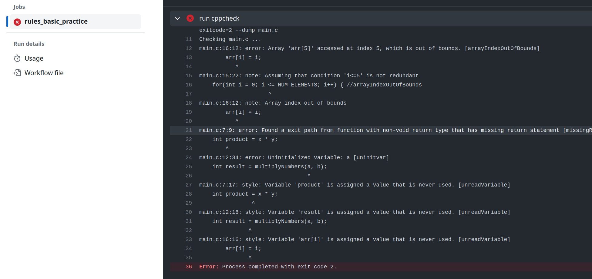

# Cppcheck

::: tip Rule 1.0
O código não deve possuir erros detectados pelo `cppcheck`.
:::

O [Cppcheck](https://cppcheck.sourceforge.io/) é um analizador de código estático capaz de fazer algumas verificações básicas em um código escrito em C/C++. Essas verificações vão além das que o compilador é capaz de realizar, e podem ajudar a identificar erros antes de executarmos um código. Por exemplo, o cppcheck pode verificar se existe uma situação na qual um loop por um array passa do tamanho de memória (*overflow*). Embora o cppcheck faça uma análise estática e tenha limitações no que consegue prever do código, já é um bom começo para escrevermos códigos mais confiáveis e com menos erros.

Para ter uma ideia, os erros mais comuns cometidos por alunos de embarcados nos semestres anteriores (análise de 22a e 22b) foram:

- **missingReturn** (53 ocorrências): Este erro ocorre quando uma função que deveria retornar um valor não o faz em todos os caminhos possíveis de execução. Isso pode levar a um comportamento indefinido no programa.

- **legacyUninitvar / uninitvar** (31 ocorrências): Indica que uma variável está sendo usada sem ser inicializada primeiro. Este é um problema antigo que pode resultar em um comportamento inesperado do programa.

- **syntaxError** (20 ocorrências): Este erro acontece quando há um problema na sintaxe do código. Isso significa que o código não segue as regras de formatação corretas da linguagem C+, tornando-o incompilável.

- **bufferAccessOutOfBounds / arrayIndexOutOfBounds** (18 ocorrências): Este erro ocorre quando o programa tenta acessar uma área de memória fora dos limites de um buffer. Isso pode resultar em um comportamento inesperado do programa ou até mesmo fazer com que ele falhe.

## Exemplo

Considere o código exemplo a seguir (==que contém erros==):

```c
#include <stdio.h>
#include <stdlib.h>

#define NUM_ELEMENTS 5

int multiplyNumbers(int x, int y) {
    int product = x * y;
}

int main(void) {
    int a, b = 5; 
    int result = multiplyNumbers(a, b);

    int arr[NUM_ELEMENTS];
    for(int i = 0; i <= NUM_ELEMENTS; i++) { 
        arr[i] = i;
    }

    return 0;
}
```

O `cppcheck` analisa o código anterior e gera o seguinte log:

```
hecking main.c ...
main.c:16:12: error: Array 'arr[5]' accessed at index 5, which is out of bounds. [arrayIndexOutOfBounds]
        arr[i] = i;
           ^
main.c:15:22: note: Assuming that condition 'i<=5' is not redundant
    for(int i = 0; i <= NUM_ELEMENTS; i++) { //arrayIndexOutOfBounds
                     ^
main.c:16:12: note: Array index out of bounds
        arr[i] = i;
           ^
main.c:7:9: error: Found an exit path from function with non-void return type that has missing return statement [missingReturn]
    int product = x * y;
        ^
main.c:12:34: error: Uninitialized variable: a [uninitvar]
    int result = multiplyNumbers(a, b);
                                 ^
main.c:7:17: style: Variable 'product' is assigned a value that is never used. [unreadVariable]
    int product = x * y;
                ^
main.c:12:16: style: Variable 'result' is assigned a value that is never used. [unreadVariable]
    int result = multiplyNumbers(a, b);
               ^
main.c:16:16: style: Variable 'arr[i]' is assigned a value that is never used. [unreadVariable]
        arr[i] = i;
               ^
nofile:0:0: information: Cppcheck cannot find all the include files (use --check-config for details) [missingIncludeSystem]
```

<!--
!!! exercise choice
    Analisandoo o código e o log gerado pelo cppcheck, indique qual o erro que a função `multiplynumbers` apresenta:
    
    - [x] `missingreturn`
    - [ ] `uninitvar`
    - [ ] `syntaxerror`
    - [ ] `bufferaccessoutofbounds`

!!! exercise choice
    E o erro da seguinte linha?
    
    ```c
    int result = multiplyNumbers(a, b);
    ```
    
    - [ ] `missingreturn`
    - [x] `uninitvar`
    - [ ] `syntaxerror`
    - [ ] `bufferaccessoutofbounds`

!!! exercise choice
    E das linhas a seguir?
    
    ```C
    int arr[NUM_ELEMENTS];
    for(int i = 0; i <= NUM_ELEMENTS; i++) { 
        arr[i] = i;
    }
    ```
 
    - [ ] `missingreturn`
    - [ ] `uninitvar`
    - [ ] `syntaxerror`
    - [x] `bufferaccessoutofbounds`
-->

## Feedback contínuo

Utilizaremos o `cppcheck` para verificar todas as entregas de sistemas embarcados de vocês. O analisador será executado automaticamente no repositório do github de cada aluno. Cada novo código submetido será verificado. Para a atividade valer nota é `obrigatório` que não haja erros no código. 

Vamos praticar e ver como isso vai funcionar na prática durante a disciplina!

- Crie um repositório com o código exemplo acessando o github classroom: {{$frontmatter.rules_cppcheck_classroom}}

- Analise o log do actions e verifique que o cppcheck executou e encontrou alguns erros: 

{width=500}

- Corrija o código `main.c` e verifique se os erros ainda continuam (dica: edite o código no próprio github).

