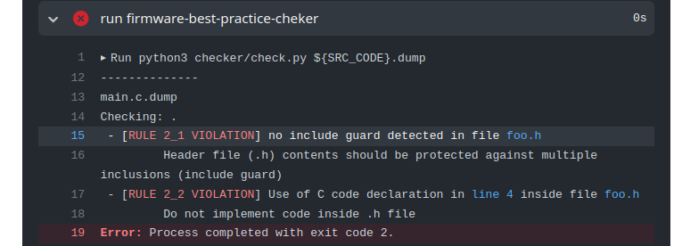
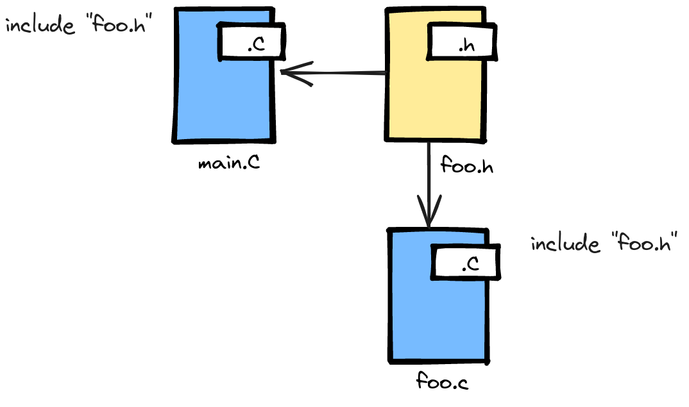
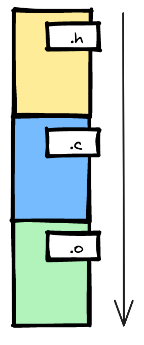

# Head File

!!! note "Rule 2.0" 
    Todo *head file* (`.h`) deve ser criado com include guard.
    
!!! note "Rule 2.1"
    Não ter implementação de código em *head file* (`.h`).

`Head file` (`.h`) é um arquivo de texto com códigos C que será processado de forma diferente do arquivo `.c` e que possibilita a melhor estruturação de um programa, sendo possível estruturar o código de uma forma mais organizada, possibilitando a criação de bibliotecas (nada parecido com python), deixando o programa mais estruturado. 

Para isso funcionar direito o *head file* deve possuir um recurso que iniba a inclusão redundante (mais de uma vez) no processo de compilação, evitando a redefinição de `defines`, `tipos` ou funções. Além desse recurso, não podemos ter no arquivo `.h` códigos que gerem instruções (ou seja, não podemos implementar uma função no `head`)!

## Exemplo

O exemplo a seguir demonstra um ==uso errado== do arquivo `.h`:

```c
// main.h
int var; 

int bar(int b) {
    if (b > 2) 
        return 0;
    return 1;
}
``` 
    
```c
// main.c
#include "main.h"

int main(void){
    int a = bar(12);
}
```

O código anterior viola a regra **2.0** e a regra **2.1** gerando o seguinte erro:



## Forma correta

Para desenvolvermos bons códigos em C devemos usar a seguinte estrutura de arquivos `.c` e `.h`:

- `.c`: É onde efetivamente implementamos nossos códigos que geram instruções.
- `.h`: Arquivo de cabećalho que auxilia na organizacão do código.

!!! warning
    Toda implementação de função deve ocorrer no arquivo `.c`!

O diagrama a seguir ilustra como devemos tratar os diferentes tipos de arquivos:



Estes arquivos quando compilados devem gerar [arquivos .o]()[^1], reparem que o arquivo `foo.c` virou um objeto `foo.o`, isso otimiza todo o processo de compilação, o gcc não precisa recompilar o `foo.c` se não houve mudanças nele.

{width=100}

Mas para isso funcionar corretamente temos que implementar algo chamado de `include guard` nos arquivos `.h`, o include guard limita a inclusão do `head` apenas uma vez no processo de compilação. O código correta fica assim:

```c
// main.c
#include "bar.h"

void main(){...}
```

```c
// bar.h
#ifndef BAR_H
#define BAR_H

int bar(int b);

#endif
```

```c
// bar.c
#include "bar.h"

int bar(int b){
...
}
```

!!! exercise choice two-cols
    Qual o par de códigos correto para um arquivo `pisca.c` e `pisca.h` que implementa a funcão `void led(void)`?
    
    === "(a)"
        `pisca.h`
        ```c
        void led(coid){
            pio_set(...); 
            pio_clear(...);
        }
        ```

        `pisca.c`
        ```c
        #ifndef PISCA_H
        #define PISCA_H
        
        #include "pisca.h"
        
        #endif        
        ```
        
    === "(b)"
    
        `pisca.h`
        ```c
        #ifndef PISCA_H
        #define PISCA_H
        
        #include "pisca.h"
        
        #endif
        ```
        
        `pisca.c`
        ```c
        #include "pisca.h"
        
        void led(coid){
            pio_set(...); 
            pio_clear(...);
        }
        ```
        
    === "\(c\)"
        `pisca.h`
        ```c
        #ifndef PISCA_H
        #define PISCA_H
        
        #include "pisca.h"
        
        void led(coid);
        
        #endif
        ```
        
        `pisca.c`
        ```c
        #include "pisca.h"
        
        void led(coid){
            pio_set(...); 
            pio_clear(...); 
        }
        ```
       
    - [ ] 
    - [ ] 
    - [x] 

    !!! answer
        O Item (C) é o único que possui todos os itens necessários:
        
        - Arquivo `.h` com include guard.
        - Arquivo `.h` com prototype das funcões.
        - Arquivo `.c` inclui arquivo `.h`.
        
        
!!! exercise choice two-cols
    Você sabe a diferença entre: `#include "foo.h"` e `#include <foo.h>`?
        
    - [x] Sim
    - [x] Não
    
    !!! answer
        Usamos `" "` para quando queremos fazer o `include` de um arquivo que pertece ao projeto apenas e `< >` quando o arquivo é uma biblioteca do sistema!
	
## Keyword *extern*
	
!!! tip
    Para que seu Head file acesse uma variável global que está na **main.c**, você precisa adicionar a keyword **extern** nessa variável dentro do arquivo head **.h**:
	
	https://www.geeksforgeeks.org/understanding-extern-keyword-in-c/
		
## Editando o CMakeList.txt

Você também vai precisar adicionar **foo.c** no arquivo CMakeList.txt:

```c
add_executable(... main.c foo.c ...)
```
       
## Praticando

Vamos praticar um pouco e corrigir as regras básicas de qualidade de código e boas práticas em sistemas embarcados, para isso crie um repositório pelo *github classroom* e então modifique os arquivos conforme indicado.

1. Crie um repositório com o código exemplo acessando o github classroom!
1. Analise o log do actions e verifique que o cppcheck executou e encontrou alguns erros.
1. Corrigir o código e verificar se ainda continuamos com erros.
