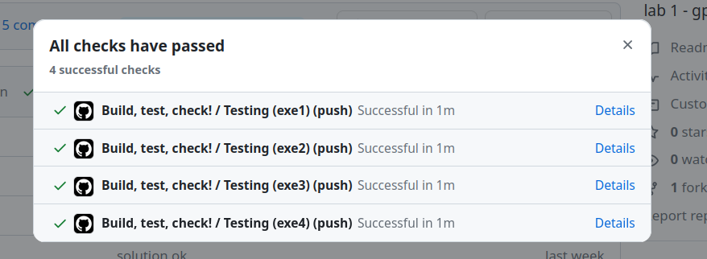
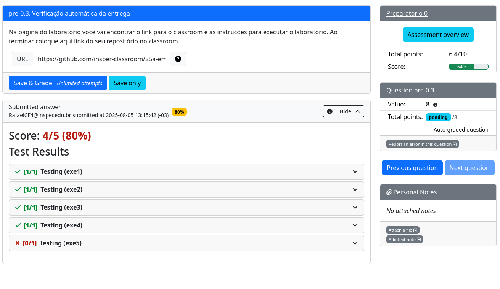

# Laboratório preparatório

Esta entrega possui verificação automática. Para validar a entrega, envie o código para o seu repositório no GitHub e verifique o resultado do Actions. O sistema verifica:

- Se o código compila.
- Teste de unidade em cada código.
- Análise da qualidade de código:
    - cppcheck *(erros básicos de linguagem C)*
    - embedded-check *(erros conceituais de sistemas embarcados)*

Vocês devem obter o seguinte resultado no Actions:

## Enviando para avaliação

Após terminar os exercícios, o mesmo deve ser submetido para avaliação na plataforma do PrairieLearn, que irá utilizar o log do GitHub Actions e liberar a nota final da atividade. Para enviar a atividade, basta copiar o link do repositório do classroom e enviar para receber a nota.

::: danger Punição de atraso
As punições de atraso serão aplicadas automaticamente pelo PrairieLearn.

- 30% até `uma semana após o prazo.`
- 0% depois de `uma semana`.
:::

Cada atividade preparatória é composta de uma série de exercícios:

## Tutorial

A seguir uma série de vídeos de como resolver os exercícios do lab prático.

Criação de respositório:

<YouTube id="3C4fwBBh190"/>

Instalando extensões e resolvendo exercícios:
<YouTube id="Bjx5leWoN4I"/>

Validação dos exercicios preparatórios.
<YouTube id="FT3GqjNrmtw"/>
